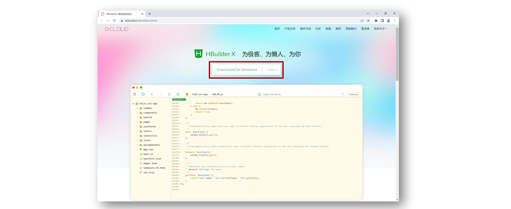
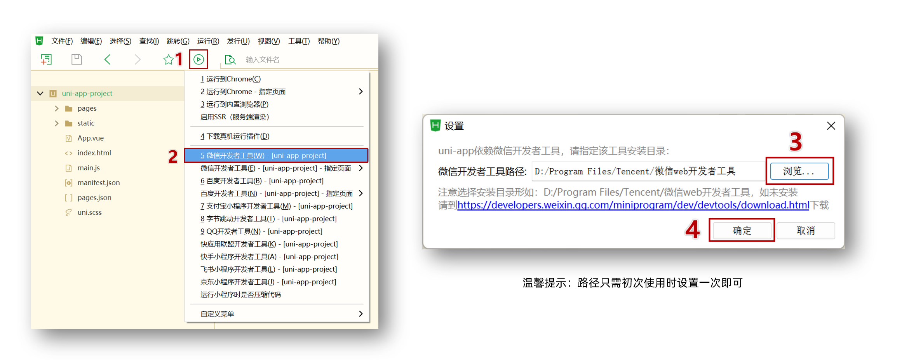
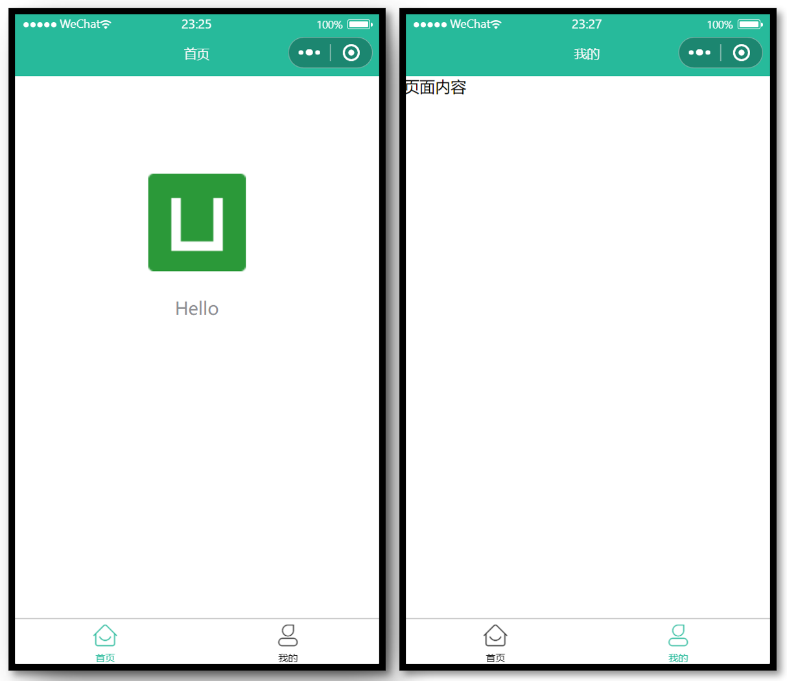
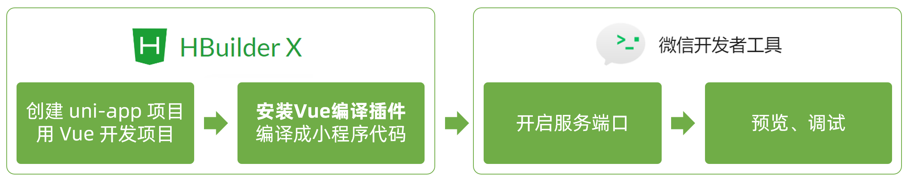
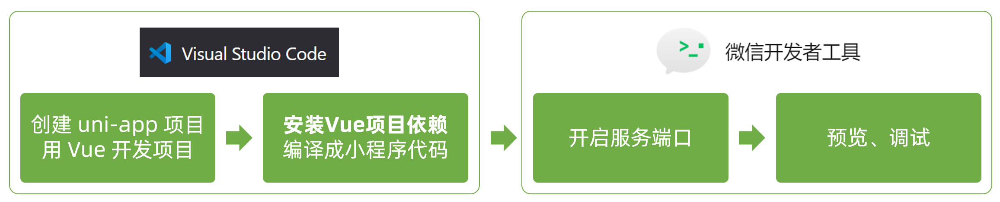

# uni-app 基础

## 创建 uni-app 项目方式

**uni-app 支持两种方式创建项目：**

1. 通过 HBuilderX 创建（需安装 HBuilderX 编辑器）

2. 通过命令行创建（需安装 NodeJS 环境）

## HBuilderX 创建 uni-app 项目

**1.下载安装 HbuilderX 编辑器**

下载地址：https://www.dcloud.io/hbuilderx.html



**2.通过 HbuilderX 创建 uni-app vue3 项目**


**3.安装 uni-app vue3 编译器插件**


**4.编译成微信小程序端代码**



**5.开启服务端口**


**小技巧分享：模拟器窗口分离和置顶**


**HBuildeX 和 微信开发者工具 关系**


tip 温馨提示：
[HBuildeX](https://www.dcloud.io/hbuilderx.html) 和 [uni-app](https://uniapp.dcloud.net.cn/) 都属于 [DCloud](https://dcloud.io) 公司的产品。

## pages.json 和 tabBar 案例

### 目录结构

我们先来认识 uni-app 项目的目录结构。

```sh {1,4,9,10}
├─pages            业务页面文件存放的目录
│  └─index
│     └─index.vue  index页面
├─static           存放应用引用的本地静态资源的目录(注意：静态资源只能存放于此)
├─unpackage        非工程代码，一般存放运行或发行的编译结果
├─index.html       H5端页面
├─main.js          Vue初始化入口文件
├─App.vue          配置App全局样式、监听应用生命周期
├─pages.json       **配置页面路由、导航栏、tabBar等页面类信息**
├─manifest.json    **配置appid**、应用名称、logo、版本等打包信息
└─uni.scss         uni-app内置的常用样式变量
```

### 解读 pages.json

用于配置页面路由、导航栏、tabBar 等页面类信息

### 案例练习

**效果预览**


**参考代码**

```json
{
	// 页面路由
	"pages": [{
			"path": "pages/index/index",
			// 页面样式配置
			"style": {
				"navigationBarTitleText": "首页"
			}
		},
		{
			"path": "pages/my/my",
			"style": {
				"navigationBarTitleText": "我的"
			}
		}
	],
	// 全局样式配置
	"globalStyle": {
		"navigationBarTextStyle": "white",
		"navigationBarTitleText": "uni-app",
		"navigationBarBackgroundColor": "#27BA9B",
		"backgroundColor": "#F8F8F8"
	},
	// tabBar 配置
	"tabBar": {
		"selectedColor": "#27BA9B",
		"list": [{
				"pagePath": "pages/index/index",
				"text": "首页",
				"iconPath": "static/tabs/home_default.png",
				"selectedIconPath": "static/tabs/home_selected.png"
			},
			{
				"pagePath": "pages/my/my",
				"text": "我的",
				"iconPath": "static/tabs/user_default.png",
				"selectedIconPath": "static/tabs/user_selected.png"
			}
		]
	}
}
```

## 命令行创建 uni-app 项目

**优势**

通过命令行创建 uni-app 项目，**不必依赖 HBuilderX**，TypeScript 类型支持友好。

**命令行创建** **uni-app** **项目：**

vite+vue3 + js 版

```sh [github]
# 通过 git 从 github 下载
git clone -b vite https://github.com/dcloudio/uni-preset-vue.git
```

```shell
# 通过 git 从 gitee 克隆下载 (👉备用地址)
git clone -b vite https://gitee.com/dcloud/uni-preset-vue.git
```


vite+vue3 + ts 版

```sh [github]
# 通过 git 从 github 下载
git clone -b vite-ts https://github.com/dcloudio/uni-preset-vue.git
```

```shell
# 通过 git 从 gitee 克隆下载 (👉备用地址)
git clone -b vite-ts https://gitee.com/dcloud/uni-preset-vue.git
```

创建其他版本可查看：[uni-app 官网](https://uniapp.dcloud.net.cn/quickstart-cli.html)

常见问题

- 在 `manifest.json` 文件添加 [小程序 AppID](https://mp.weixin.qq.com/) 用于真机预览


### 编译和运行 uni-app 项目

1. 安装依赖 `pnpm install`
2. 编译成微信小程序 `pnpm dev:mp-weixin`
3. 导入微信开发者工具


编译成 H5 端可运行 `pnpm dev:h5` 通过浏览器预览项目。

## 用 VS Code 开发 uni-app 项目

### 为什么选择 VS Code？

- VS Code 对 **TS 类型支持友好**，前端开发者**主流的编辑器**
- HbuilderX 对 TS 类型支持暂不完善，期待官方完善 👀

### 用 VS Code 开发配置

- 👉 前置工作：安装 Vue3 插件，[点击查看官方文档](https://cn.vuejs.org/guide/typescript/overview.html#ide-support)
  - 安装 **Vue Language Features (Volar)** ：Vue3 语法提示插件
  - 安装 **TypeScript Vue Plugin (Volar)** ：Vue3+TS 插件
  - **工作区禁用** Vue2 的 Vetur 插件(Vue3 插件和 Vue2 冲突)
  - **工作区禁用** @builtin typescript 插件（禁用后开启 Vue3 的 TS 托管模式）
- 👉 安装 uni-app 开发插件
  - **uni-create-view** ：快速创建 uni-app 页面
  - **uni-helper uni-app** ：代码提示
  - **uniapp 小程序扩展** ：鼠标悬停查文档
- 👉 TS 类型校验
  - 安装 **类型声明文件** `pnpm i -D miniprogram-api-typings @uni-helper/uni-app-types`
  - 配置 `tsconfig.json`
- 👉 JSON 注释问题
  - 设置文件关联，把 `manifest.json` 和 `pages.json` 设置为 `jsonc`

`tsconfig.json` 参考

```json {11,12,14-15,18-22}
// tsconfig.json
{
  "extends": "@vue/tsconfig/tsconfig.json",
  "compilerOptions": {
    "sourceMap": true,
    "baseUrl": ".",
    "paths": {
      "@/*": ["./src/*"]
    },
    "lib": ["esnext", "dom"],
    // 类型声明文件
    "types": [
      "@dcloudio/types", // uni-app API 类型
      "miniprogram-api-typings", // 原生微信小程序类型
      "@uni-helper/uni-app-types" // uni-app 组件类型
    ]
  },
  // vue 编译器类型，校验标签类型
  "vueCompilerOptions": {
    // 原配置 `experimentalRuntimeMode` 现调整为 `nativeTags`
    "nativeTags": ["block", "component", "template", "slot"], // [!code ++]
    "experimentalRuntimeMode": "runtime-uni-app" // [!code --]
  },
  "include": ["src/**/*.ts", "src/**/*.d.ts", "src/**/*.tsx", "src/**/*.vue"]
}
```

**工作区设置参考**

```json
// .vscode/settings.json
{
  // 在保存时格式化文件
  "editor.formatOnSave": true,
  // 文件格式化配置
  "[json]": {
    "editor.defaultFormatter": "esbenp.prettier-vscode"
  },
  // 配置语言的文件关联
  "files.associations": {
    "pages.json": "jsonc", // pages.json 可以写注释
    "manifest.json": "jsonc" // manifest.json 可以写注释
  }
}
```

版本升级

- 原依赖 `@types/wechat-miniprogram` 现调整为 [miniprogram-api-typings](https://github.com/wechat-miniprogram/api-typings)。
- 原配置 `experimentalRuntimeMode` 现调整为 `nativeTags`。

这一步处理很关键，否则 TS 项目无法校验组件属性类型。

## 用idea开发 uni-app 项目

安装插件`vue.js`、`uniapp support`和`uniapp tool`插件

 JSON 注释问题

- 设置文件关联，File->File Types->找到Json5，把 `jsconfig.json`、`manifest.json` 和 `pages.json` 文件添加到配置中，.json文件就会以Json5的格式识别


## 开发工具回顾

选择自己习惯的编辑器开发 uni-app 项目即可。

**HbuilderX 和 微信开发者工具 关系**


**VS Code 和 微信开发者工具 关系**


# 项目框架搭建

## 引入 uni-ui 组件库

**准备 sass**

```
pnpm i sass sass-loader -D
```

**安装 uni-ui**

安装 [uni-ui 组件库](https://uniapp.dcloud.net.cn/component/uniui/quickstart.html#npm安装)

```
pnpm i @dcloudio/uni-ui
```

**配置easycom自动导入组件**

安装好 `uni-ui` 之后，需要配置 `easycom` 规则，让 `npm` 安装的组件支持 `easycom`

打开项目根目录下的 `pages.json` 并添加 `easycom` 节点：

```json
// pages.json
{
    // 组件自动导入
	"easycom": {
		"autoscan": true,
        // 以正则方式自定义组件匹配规则
		"custom": {
			// uni-ui 规则如下配置
			"^uni-(.*)": "@dcloudio/uni-ui/lib/uni-$1/uni-$1.vue"
		}
	},
	
	// 其他内容
	pages:[
		// ...
	]
}
```

**安装类型声明文件**

```sh
pnpm i -D @uni-helper/uni-ui-types
```

**配置类型声明文件**

```json
// jsconfig.json
{
  "compilerOptions": {
    "allowJs": true,
    "sourceMap": true,
    "baseUrl": "./",
    "paths": {
      "@/*": [
        "src/*"
      ]
    },
    "lib": [
      "esnext",
      "dom"
    ],
    "types": [
      // uni-app API 类型
      "@dcloudio/types",
      // 原生微信小程序类型
      "miniprogram-api-typings",
      // uni-app 组件类型
      "@uni-helper/uni-app-types",
      // uni-ui 组件类型
      "@uni-helper/uni-ui-types"
    ]
  },
  // vue 编译器类型，校验标签类型
  "vueCompilerOptions": {
    "nativeTags": [
      "block",
      "component",
      "template",
      "slot"
    ]
  },
  "include": [
    "src/**/*.js",
    "src/**/*.vue"
  ]
}
```

## 小程序端 Pinia 持久化

### 安装pinia

```shell
pnpm i pinia@2.0.34
```

说明：`Pinia` 用法与 `Vue3` 项目完全一致，`uni-app` 项目仅需解决**持久化插件兼容性**问题。

### 持久化存储插件

安装持久化存储插件： [pinia-plugin-persistedstate](https://prazdevs.github.io/pinia-plugin-persistedstate/zh/guide/config.html#storage)

```shell
pnpm i pinia-plugin-persistedstate
```

插件默认使用 `localStorage` 实现持久化，小程序端不兼容，需要替换持久化 API。

### 基本用法

src/store/modules/member.js

```javascript
//创建用户相关的小仓库
import {defineStore} from 'pinia'
//创建用户小仓库
const useMemberStore = defineStore('member', {
        //小仓库存储数据地方
        state: () => {
            return {
                profile: null,
            }
        },
        //处理异步|逻辑地方
        actions: {
            // 保存会员信息，登录时使用
            setProfile(val) {
                this.profile.value = val
            },
            // 清理会员信息，退出时使用
            clearProfile() {
                this.profile.value = null
            },
        },
        getters: {},
    },
    {
        // 配置持久化
        persist: {
            // 调整为兼容多端的API
            storage: {
                setItem(key, value) {
                    uni.setStorageSync(key, value)
                },
                getItem(key) {
                    return uni.getStorageSync(key)
                },
            },
        },
    },
)

//对外暴露小仓库
export default useMemberStore
```

src\store\index.js

```javascript
import { createPinia } from 'pinia'
import persist from 'pinia-plugin-persistedstate'

// 创建 pinia 实例
const pinia = createPinia()
// 使用持久化存储插件
pinia.use(persist)

// 默认导出，给 main.ts 使用
export default pinia
```

src/main.js

```javascript
import {createSSRApp} from "vue";
import App from "./App.vue";
import pinia from './store'

export function createApp() {
    const app = createSSRApp(App);
    app.use(pinia)
    return {
        app,
    };
}

```

### 多端兼容持久化配置

**网页端持久化 API**

```javascript
// 网页端API
localStorage.setItem()
localStorage.getItem()
```

**多端持久化 API**

```javascript
// 兼容多端API
uni.setStorageSync()
uni.getStorageSync()
```

**参考代码**

src/store/modules/member.js

```javascript
//创建用户相关的小仓库
import {defineStore} from 'pinia'
//创建用户小仓库
const useMemberStore = defineStore('member', {
        //小仓库存储数据地方
        state: () => {
            return {
                profile: null,
            }
        },
        //处理异步|逻辑地方
        actions: {},
        getters: {},
    },
    {
        // 配置持久化
        persist: {
            // 调整为兼容多端的API
            storage: {
                setItem(key, value) {
                    uni.setStorageSync(key, value)
                },
                getItem(key) {
                    return uni.getStorageSync(key)
                },
            },
        },
    },
)

//对外暴露小仓库
export default useMemberStore
```

## uni.request 请求封装

### 请求和上传文件拦截器

**uniapp 拦截器**： [uni.addInterceptor](https://uniapp.dcloud.net.cn/api/interceptor.html)

**接口说明**：[接口文档](https://www.apifox.cn/apidoc/shared-0e6ee326-d646-41bd-9214-29dbf47648fa/doc-1521513)

实现需求

1. 拼接基础地址
2. 设置超时时间
3. 添加请求头标识
4. 添加 token

**参考代码**

src/utils/request.js

```javascript
/**
 * 添加拦截器:
 *   拦截 request 请求
 *   拦截 uploadFile 文件上传
 *
 *   1. 非 http 开头拼接地址
 *   2. 请求超时
 *   3. 添加小程序端请求头标识
 *   4. 添加 token 请求头标识
 */

import useMemberStore from "@/store/modules/member";

const baseURL = import.meta.env.VITE_APP_SERVER + import.meta.env.VITE_APP_BASE_API

// 添加拦截器
const httpInterceptor = {
    // 拦截前触发
    invoke(options) {
        // 1. 非 http 开头需拼接地址
        if (!options.url.startsWith('http')) {
            options.url = baseURL + options.url
        }
        // 2. 请求超时, 默认 60s
        options.timeout = 5000
        // 3. 添加小程序端请求头标识
        options.header = {
            ...options.header,
            'source-client': 'miniapp',
        }
        // 4. 添加 token 请求头标识
        const memberStore = useMemberStore()
        const token = memberStore.profile?.token
        if (token) {
            options.header.Authorization = token
        }
    },
}
uni.addInterceptor('request', httpInterceptor)
uni.addInterceptor('uploadFile', httpInterceptor)
```

### 封装 Promise 请求函数

1. 返回 Promise 对象，用于处理返回值类型
2. 成功 resolve 提取数据
3. 失败 reject
   1. 401 错误
   2. 其他错误
   3. 网络错误

**参考代码**

src/utils/request.js

```javascript
/**
 * 请求函数
 * @param  UniApp.RequestOptions
 * @returns Promise
 *  1. 返回 Promise 对象
 *  2. 获取数据成功 提取核心数据 res.data
 *  3. 获取数据失败
 *    3.1 401错误  -> 清理用户信息，跳转到登录页
 *    3.2 其他错误 -> 根据后端错误信息轻提示
 *    3.3 网络错误 -> 提示用户换网络
 */

export const request = (options) => {
    // 1. 返回 Promise 对象
    return new Promise((resolve, reject) => {
        uni.request({
            ...options,
            // 响应成功
            success(res) {
                // 状态码 2xx， axios 就是这样设计的
                if (res.statusCode >= 200 && res.statusCode < 300) {
                    // 2 提取核心数据 res.data
                    resolve(res.data)
                } else if (res.statusCode === 401) {
                    // 401错误  -> 清理用户信息，跳转到登录页
                    const memberStore = useMemberStore()
                    memberStore.clearProfile()
                    uni.navigateTo({url: '/pages/login/login'})
                    reject(res)
                } else {
                    // 其他错误 -> 根据后端错误信息轻提示
                    uni.showToast({
                        icon: 'none',
                        title: res.data?.msg || '请求错误',
                    })
                    reject(res)
                }
            },
            // 响应失败
            fail(err) {
                uni.showToast({
                    icon: 'none',
                    title: '网络错误，换个网络试试',
                })
                reject(err)
            },
        })
    })
}

```

