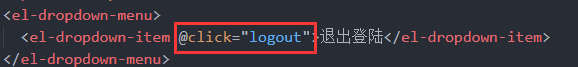

此次教学课程为硅谷甄选运营平台项目,包含运营平台项目模板从0到1开发，以及数据大屏幕、权限等业务。

此次教学课程涉及到技术栈包含***:vue3+TypeScript+vue-router+pinia+element-plus+axios+echarts***等技术栈。

# 1、搭建后台管理系统模板

## 1.1项目初始化

今天来带大家从0开始搭建一个vue3版本的后台管理系统。一个项目要有统一的规范，需要使用eslint+stylelint+prettier来对我们的代码质量做检测和修复，需要使用husky来做commit拦截，需要使用commitlint来统一提交规范，需要使用preinstall来统一包管理工具。

下面我们就用这一套规范来初始化我们的项目，集成一个规范的模版。

### 1.1.1环境准备

- node v16.14.2 
- pnpm 8.0.0

### 1.1.2初始化项目

本项目使用vite进行构建，vite官方中文文档参考：[cn.vitejs.dev/guide/](https://cn.vitejs.dev/guide/)

**pnpm:performant npm ，意味“高性能的 npm”。[pnpm](https://so.csdn.net/so/search?q=pnpm&spm=1001.2101.3001.7020)由npm/yarn衍生而来，解决了npm/yarn内部潜在的bug，极大的优化了性能，扩展了使用场景。被誉为“最先进的包管理工具”**

pnpm安装指令

```
npm i -g pnpm
```

项目初始化命令:

```
pnpm create vite
```

进入到项目根目录pnpm install安装全部依赖.安装完依赖运行程序:pnpm run dev

运行完毕项目跑在http://127.0.0.1:5173/,可以访问你得项目啦

package.json 中 dev命令后面添加 --open 自动打开浏览器

```json
  "scripts": {
    "dev": "vite --open",
    "build": "vue-tsc && vite build",
    "preview": "vite preview"
  },
```


## 1.2项目配置

### 一、eslint配置

**eslint中文官网:http://eslint.cn/**

ESLint最初是由[Nicholas C. Zakas](http://nczonline.net/) 于2013年6月创建的开源项目。它的目标是提供一个插件化的**javascript代码检测工具**

首先安装eslint

```
pnpm i eslint -D
```

生成配置文件:.eslint.cjs

```
npx eslint --init

选项选择 
1. How would you like to use ESLint?
- To check syntax and find problems
2. What type of modules does your project use?
- JavaScript modules (import/export)
3. Which framework does your project use?
- Vue.js
4. Does your project use TypeScript?
- Yes
5. Where does your code run?
- browser
6. What format do you want your config file to be in?
- JavaScript
7. Would you like to install them now?
- Yes
8. Which package manager do you want to use?
- pnpm


```

**.eslint.cjs配置文件**

```
module.exports = {
   //运行环境
    "env": { 
        "browser": true,//浏览器端
        "es2021": true,//es2021
    },
    //规则继承
    "extends": [ 
       //全部规则默认是关闭的,这个配置项开启推荐规则,推荐规则参照文档
       //比如:函数不能重名、对象不能出现重复key
        "eslint:recommended",
        //vue3语法规则
        "plugin:vue/vue3-essential",
        //ts语法规则
        "plugin:@typescript-eslint/recommended"
    ],
    //要为特定类型的文件指定处理器
    "overrides": [
    ],
    //指定解析器:解析器
    //Esprima 默认解析器
    //Babel-ESLint babel解析器
    //@typescript-eslint/parser ts解析器
    "parser": "@typescript-eslint/parser",
    //指定解析器选项
    "parserOptions": {
        "ecmaVersion": "latest",//校验ECMA最新版本
        "sourceType": "module"//设置为"script"（默认），或者"module"代码在ECMAScript模块中
    },
    //ESLint支持使用第三方插件。在使用插件之前，您必须使用npm安装它
    //该eslint-plugin-前缀可以从插件名称被省略
    "plugins": [
        "vue",
        "@typescript-eslint"
    ],
    //eslint规则
    "rules": {
    }
}
```

#### 1.1vue3环境代码校验插件

```
# 让所有与prettier规则存在冲突的Eslint rules失效，并使用prettier进行代码检查
"eslint-config-prettier": "^8.6.0",
"eslint-plugin-import": "^2.27.5",
"eslint-plugin-node": "^11.1.0",
# 运行更漂亮的Eslint，使prettier规则优先级更高，Eslint优先级低
"eslint-plugin-prettier": "^4.2.1",
# vue.js的Eslint插件（查找vue语法错误，发现错误指令，查找违规风格指南
"eslint-plugin-vue": "^9.9.0",
# 该解析器允许使用Eslint校验所有babel code
"@babel/eslint-parser": "^7.19.1",
```

安装指令

```
pnpm install -D eslint-plugin-import eslint-plugin-vue eslint-plugin-node eslint-plugin-prettier eslint-config-prettier eslint-plugin-node @babel/eslint-parser
```

#### 1.2修改.eslintrc.cjs配置文件

```
// @see https://eslint.bootcss.com/docs/rules/

module.exports = {
  env: {
    browser: true,
    es2021: true,
    node: true,
    jest: true,
  },
  /* 指定如何解析语法 */
  parser: 'vue-eslint-parser',
  /** 优先级低于 parse 的语法解析配置 */
  parserOptions: {
    ecmaVersion: 'latest',
    sourceType: 'module',
    parser: '@typescript-eslint/parser',
    jsxPragma: 'React',
    ecmaFeatures: {
      jsx: true,
    },
  },
  /* 继承已有的规则 */
  extends: [
    'eslint:recommended',
    'plugin:vue/vue3-essential',
    'plugin:@typescript-eslint/recommended',
    'plugin:prettier/recommended',
  ],
  plugins: ['vue', '@typescript-eslint'],
  /*
   * "off" 或 0    ==>  关闭规则
   * "warn" 或 1   ==>  打开的规则作为警告（不影响代码执行）
   * "error" 或 2  ==>  规则作为一个错误（代码不能执行，界面报错）
   */
  rules: {
    // eslint（https://eslint.bootcss.com/docs/rules/）
    'no-var': 'error', // 要求使用 let 或 const 而不是 var
    'no-multiple-empty-lines': ['warn', { max: 1 }], // 不允许多个空行
    'no-console': process.env.NODE_ENV === 'production' ? 'error' : 'off',
    'no-debugger': process.env.NODE_ENV === 'production' ? 'error' : 'off',
    'no-unexpected-multiline': 'error', // 禁止空余的多行
    'no-useless-escape': 'off', // 禁止不必要的转义字符

    // typeScript (https://typescript-eslint.io/rules)
    '@typescript-eslint/no-unused-vars': 'error', // 禁止定义未使用的变量
    '@typescript-eslint/prefer-ts-expect-error': 'error', // 禁止使用 @ts-ignore
    '@typescript-eslint/no-explicit-any': 'off', // 禁止使用 any 类型
    '@typescript-eslint/no-non-null-assertion': 'off',
    '@typescript-eslint/no-namespace': 'off', // 禁止使用自定义 TypeScript 模块和命名空间。
    '@typescript-eslint/semi': 'off',

    // eslint-plugin-vue (https://eslint.vuejs.org/rules/)
    'vue/multi-word-component-names': 'off', // 要求组件名称始终为 “-” 链接的单词
    'vue/script-setup-uses-vars': 'error', // 防止<script setup>使用的变量<template>被标记为未使用
    'vue/no-mutating-props': 'off', // 不允许组件 prop的改变
    'vue/attribute-hyphenation': 'off', // 对模板中的自定义组件强制执行属性命名样式
  },
}

```

#### 1.3在项目根目录下创建 .eslintignore 忽略文件

```
dist
node_modules
```

#### 1.4运行脚本

package.json新增两个运行脚本

```
"scripts": {
    "lint": "eslint src",
    "fix": "eslint src --fix",
}
```

可以使用这两个命令：校验和修复

```
pnpm run lint
pnpm run fix
```


### 二、配置prettier

有了eslint，为什么还要有prettier？eslint针对的是javascript，他是一个检测工具，包含js语法以及少部分格式问题，在eslint看来，语法对了就能保证代码正常运行，格式问题属于其次；

而prettier属于格式化工具，它看不惯格式不统一，所以它就把eslint没干好的事接着干，另外，prettier支持

包含js在内的多种语言。

总结起来，**eslint和prettier这俩兄弟一个保证js代码质量，一个保证代码美观。**

#### 2.1安装依赖包

```
pnpm install -D eslint-plugin-prettier prettier eslint-config-prettier
```

#### 2.2在项目根目录下创建 .prettierrc.json 添加规则

```
{
  "singleQuote": true,
  "semi": false,
  "bracketSpacing": true,
  "htmlWhitespaceSensitivity": "ignore",
  "endOfLine": "auto",
  "trailingComma": "all",
  "tabWidth": 2
}
```

#### 2.3在项目根目录下创建 .prettierignore 忽略文件

```
/dist/*
/html/*
.local
/node_modules/**
**/*.svg
**/*.sh
/public/*
```

**通过pnpm run lint去检测语法，如果出现不规范格式,通过pnpm run fix 修改**

### 三、配置stylelint

[stylelint](https://stylelint.io/)为css的lint工具。可格式化css代码，检查css语法错误与不合理的写法，指定css书写顺序等。

我们的项目中使用scss作为预处理器，安装以下依赖：

```
pnpm add sass sass-loader stylelint postcss postcss-scss postcss-html stylelint-config-prettier stylelint-config-recess-order stylelint-config-recommended-scss stylelint-config-standard stylelint-config-standard-vue stylelint-scss stylelint-order stylelint-config-standard-scss -D
```

#### 3.1在项目根目录下创建 `.stylelintrc.cjs` **配置文件**

**官网:https://stylelint.bootcss.com/**

```
// @see https://stylelint.bootcss.com/

module.exports = {
  extends: [
    'stylelint-config-standard', // 配置stylelint拓展插件
    'stylelint-config-html/vue', // 配置 vue 中 template 样式格式化
    'stylelint-config-standard-scss', // 配置stylelint scss插件
    'stylelint-config-recommended-vue/scss', // 配置 vue 中 scss 样式格式化
    'stylelint-config-recess-order', // 配置stylelint css属性书写顺序插件,
    'stylelint-config-prettier', // 配置stylelint和prettier兼容
  ],
  overrides: [
    {
      files: ['**/*.(scss|css|vue|html)'],
      customSyntax: 'postcss-scss',
    },
    {
      files: ['**/*.(html|vue)'],
      customSyntax: 'postcss-html',
    },
  ],
  ignoreFiles: [
    '**/*.js',
    '**/*.jsx',
    '**/*.tsx',
    '**/*.ts',
    '**/*.json',
    '**/*.md',
    '**/*.yaml',
  ],
  /**
   * null  => 关闭该规则
   * always => 必须
   */
  rules: {
    'value-keyword-case': null, // 在 css 中使用 v-bind，不报错
    'no-descending-specificity': null, // 禁止在具有较高优先级的选择器后出现被其覆盖的较低优先级的选择器
    'function-url-quotes': 'always', // 要求或禁止 URL 的引号 "always(必须加上引号)"|"never(没有引号)"
    'no-empty-source': null, // 关闭禁止空源码
    'selector-class-pattern': null, // 关闭强制选择器类名的格式
    'property-no-unknown': null, // 禁止未知的属性(true 为不允许)
    'block-opening-brace-space-before': 'always', //大括号之前必须有一个空格或不能有空白符
    'value-no-vendor-prefix': null, // 关闭 属性值前缀 --webkit-box
    'property-no-vendor-prefix': null, // 关闭 属性前缀 -webkit-mask
    'selector-pseudo-class-no-unknown': [
      // 不允许未知的选择器
      true,
      {
        ignorePseudoClasses: ['global', 'v-deep', 'deep'], // 忽略属性，修改element默认样式的时候能使用到
      },
    ],
  },
}
```

#### 3.2在项目根目录下创建 .stylelintignore 忽略文件

```
/node_modules/*
/dist/*
/html/*
/public/*
```

#### 3.3运行脚本

```
"scripts": {
	"lint:style": "stylelint src/**/*.{css,scss,vue} --cache --fix"
}
```

最后配置统一的prettier来格式化我们的js和css，html代码

```
 "scripts": {
    "dev": "vite --open",
    "build": "vue-tsc && vite build",
    "preview": "vite preview",
    "lint": "eslint src",
    "fix": "eslint src --fix",
    "format": "prettier --write \"./**/*.{html,vue,ts,js,json,md}\"",
    "lint:eslint": "eslint src/**/*.{ts,vue} --cache --fix",
    "lint:style": "stylelint src/**/*.{css,scss,vue} --cache --fix"
  },
```

**当我们运行`pnpm run format`的时候，会把代码直接格式化**

### 四、配置husky

在上面我们已经集成好了我们代码校验工具，但是需要每次手动的去执行命令才会格式化我们的代码。如果有人没有格式化就提交了远程仓库中，那这个规范就没什么用。所以我们需要强制让开发人员按照代码规范来提交。

要做到这件事情，就需要利用husky在代码提交之前触发git hook(git在客户端的钩子)，然后执行`pnpm run format`来自动的格式化我们的代码。

安装`husky`

```
pnpm install -D husky
```

执行

```
npx husky-init
```

会在根目录下生成个一个.husky目录，在这个目录下面会有一个pre-commit文件，这个文件里面的命令在我们执行commit的时候就会执行

在`.husky/pre-commit`文件添加如下命令：

```
#!/usr/bin/env sh
. "$(dirname -- "$0")/_/husky.sh"
pnpm run format
```

当我们对代码进行commit操作的时候，就会执行命令，对代码进行格式化，然后再提交。

### 五、配置commitlint

对于我们的commit信息，也是有统一规范的，不能随便写,要让每个人都按照统一的标准来执行，我们可以利用**commitlint**来实现。

安装包

```
pnpm add @commitlint/config-conventional @commitlint/cli -D
```

添加配置文件，在项目根目录下新建`commitlint.config.cjs`(注意是cjs)，然后添加下面的代码：

```
module.exports = {
  extends: ['@commitlint/config-conventional'],
  // 校验规则
  rules: {
    'type-enum': [
      2,
      'always',
      [
        'feat',
        'fix',
        'docs',
        'style',
        'refactor',
        'perf',
        'test',
        'chore',
        'revert',
        'build',
      ],
    ],
    'type-case': [0],
    'type-empty': [0],
    'scope-empty': [0],
    'scope-case': [0],
    'subject-full-stop': [0, 'never'],
    'subject-case': [0, 'never'],
    'header-max-length': [0, 'always', 72],
  },
}
```

在`package.json`中配置scripts命令

```
# 在scrips中添加下面的代码
{
"scripts": {
    "commitlint": "commitlint --config commitlint.config.cjs -e -V"
  },
}
```

配置结束，现在当我们填写`commit`信息的时候，前面就需要带着下面的`subject`

```
'feat',//新特性、新功能
'fix',//修改bug
'docs',//文档修改
'style',//代码格式修改, 注意不是 css 修改
'refactor',//代码重构
'perf',//优化相关，比如提升性能、体验
'test',//测试用例修改
'chore',//其他修改, 比如改变构建流程、或者增加依赖库、工具等
'revert',//回滚到上一个版本
'build',//编译相关的修改，例如发布版本、对项目构建或者依赖的改动
```

配置husky

```
npx husky add .husky/commit-msg 
```

在生成的commit-msg文件中添加下面的命令

```
#!/usr/bin/env sh
. "$(dirname -- "$0")/_/husky.sh"
pnpm commitlint
```

当我们 commit 提交信息时，就不能再随意写了，必须是 git commit -m 'fix: xxx' 符合类型的才可以，**需要注意的是类型的后面需要用英文的 :，并且冒号后面是需要空一格的，这个是不能省略的**

### 六、强制使用pnpm包管理器工具

团队开发项目的时候，需要统一包管理器工具,因为不同包管理器工具下载同一个依赖,可能版本不一样,

导致项目出现bug问题,因此包管理器工具需要统一管理！！！

在根目录创建`scritps/preinstall.js`文件，添加下面的内容

```
if (!/pnpm/.test(process.env.npm_execpath || '')) {
  console.warn(
    `\u001b[33mThis repository must using pnpm as the package manager ` +
    ` for scripts to work properly.\u001b[39m\n`,
  )
  process.exit(1)
}
```

配置命令

```
"scripts": {
	"preinstall": "node ./scripts/preinstall.js"
}
```

**当我们使用npm或者yarn来安装包的时候，就会报错了。原理就是在install的时候会触发preinstall（npm提供的生命周期钩子）这个文件里面的代码。**

# 2、项目集成

## 2.1集成element-plus

硅谷甄选运营平台,UI组件库采用的element-plus，因此需要集成element-plus插件！！！

官网地址:https://element-plus.gitee.io/zh-CN/

```
pnpm install element-plus @element-plus/icons-vue
```

**入口文件main.ts全局安装element-plus,element-plus默认支持语言英语设置为中文**

```
// 引入ElementPlus插件与样式
import ElementPlus from 'element-plus'
import 'element-plus/dist/index.css'
// 配置ElementPlus国际化
//@ts-ignore忽略当前文件ts类型的检测否则有红色提示(打包会失败)
import zhCn from 'element-plus/dist/locale/zh-cn.mjs'
// 安装ElementPlus插件
app.use(ElementPlus, {
    locale: zhCn//ElementPlus国际化配置
})
```


**Element Plus全局组件类型声明**

如果您使用 Volar，请在 `tsconfig.json` 中通过 `compilerOptions.type` 指定全局组件类型。

```
// tsconfig.json
{
  "compilerOptions": {
    // ...
    "types": ["element-plus/global"]
  }
}
```

配置完毕可以测试element-plus组件与图标的使用.

## 2.2src别名的配置

在开发项目的时候文件与文件关系可能很复杂，因此我们需要给src文件夹配置一个别名！！！

```typescript
// vite.config.ts
import {defineConfig} from 'vite'
import vue from '@vitejs/plugin-vue'
import path from 'path'
export default defineConfig({
    plugins: [vue()],
    // 路径别名设置
    resolve: {
        alias: {
            "@": path.resolve("./src") // 相对路径别名配置，使用 @ 代替 src
        }
    }
})
```

**TypeScript 编译配置**

```json
// tsconfig.json
{
  "compilerOptions": {
    "baseUrl": "./", // 解析非相对模块的基地址，默认是当前目录
    "paths": { //路径映射，相对于baseUrl
      "@/*": ["src/*"] 
    }
  }
}
```

## 2.3环境变量的配置

**项目开发过程中，至少会经历开发环境、测试环境和生产环境(即正式环境)三个阶段。不同阶段请求的状态(如接口地址等)不尽相同，若手动切换接口地址是相当繁琐且易出错的。于是环境变量配置的需求就应运而生，我们只需做简单的配置，把环境状态切换的工作交给代码。**

开发环境（development）
顾名思义，开发使用的环境，每位开发人员在自己的dev分支上干活，开发到一定程度，同事会合并代码，进行联调。

测试环境（testing）
测试同事干活的环境啦，一般会由测试同事自己来部署，然后在此环境进行测试

生产环境（production）
生产环境是指正式提供对外服务的，一般会关掉错误报告，打开错误日志。(正式提供给客户使用的环境。)

注意:一般情况下，一个环境对应一台服务器,也有的公司开发与测试环境是一台服务器！！！

项目根目录分别添加 开发、生产和测试环境的文件!

```
.env.development
.env.production
.env.test
```

文件内容

```
# 变量必须以 VITE_ 为前缀才能暴露给外部读取
NODE_ENV = 'development'
VITE_APP_TITLE = '硅谷甄选运营平台'
VITE_APP_BASE_API = '/dev-api'
```

```
NODE_ENV = 'production'
VITE_APP_TITLE = '硅谷甄选运营平台'
VITE_APP_BASE_API = '/prod-api'
```

```
# 变量必须以 VITE_ 为前缀才能暴露给外部读取
NODE_ENV = 'test'
VITE_APP_TITLE = '硅谷甄选运营平台'
VITE_APP_BASE_API = '/test-api'
```

配置运行命令：package.json

```
 "scripts": {
    "build:test": "vue-tsc && vite build --mode test",
    "build:pro": "vue-tsc && vite build --mode production",
  },
```

通过import.meta.env获取环境变量

## 2.4SVG图标配置

在开发项目的时候经常会用到svg矢量图,而且我们使用SVG以后，页面上加载的不再是图片资源,

这对页面性能来说是个很大的提升，而且我们SVG文件比img要小的很多，放在项目中几乎不占用资源。

https://github.com/vbenjs/vite-plugin-svg-icons

**安装SVG依赖插件**

```
pnpm install vite-plugin-svg-icons -D
```

**在`vite.config.ts`中配置插件**

```typescript
// 引入svg需要用到的插件
import { createSvgIconsPlugin } from 'vite-plugin-svg-icons'
export default defineConfig({
  plugins: [
    vue(),
    createSvgIconsPlugin({
      // Specify the icon folder to be cached
      iconDirs: [path.resolve(process.cwd(), 'src/assets/icons')],
      // Specify symbolId format
      symbolId: 'icon-[dir]-[name]',
    }),
  ],
})
```

**入口文件main.ts导入**

```
// svg插件配置代码
import 'virtual:svg-icons-register'
```

### 2.4.1svg封装为全局组件

因为项目很多模块需要使用图标,因此把它封装为全局组件！！！

**在src/components目录下创建一个SvgIcon组件:代表如下**

```vue
<template>
    <div>
        <!-- svg:图标外层容器节点,内部需要与use标签结合使用-->
        <svg :style="{ width: width, height: height }">
            <!-- xlink :href执行用哪一个图标,属性值务必#icon-图标名字 -->
            <!-- use标签fill属性可以设置图标的颜色 -->
            <use :xlink:href="prefix + name" :fill="color"></use>
        </svg>
    </div>
</template>
  
<script setup lang="ts">
// 接收父组件传来的属性
defineProps({
    //xlink:href属性值的前缀
    prefix: {
        type: String,
        default: '#icon-'
    },
    //svg矢量图的名字
    name: String,
    //svg图标的颜色
    color: {
        type: String,
        default: ""
    },
    //svg宽度
    width: {
        type: String,
        default: '16px'
    },
    //svg高度
    height: {
        type: String,
        default: '16px'
    }

})
</script>
<style scoped></style>
```

在src/components文件夹目录下创建一个index.ts文件：用于注册components文件夹内部全部全局组件！！！

```typescript
import SvgIcon from './SvgIcon/index.vue'
import type { App, Component } from 'vue'

// 全局对象设置
const components: { [name: string]: Component } = { SvgIcon }
// 对外暴露插件对象
export default {
  // 务必是install方法
  install(app: App) {
    Object.keys(components).forEach((key: string) => {
      // 注册为全局组件
      app.component(key, components[key])
    })
  },
}

```

在入口文件引入src/index.ts文件,通过app.use方法安装自定义插件

```typescript
// 引入自定义插件对象:注册整个项目全局组件
import gloablComponent from '@/components/index'
// 安装自定义插件
app.use(gloablComponent)
```

以后不需要import都可以直接使用

## 2.5集成sass

我们目前在组件内部已经可以使用scss样式,因为在配置styleLint工具的时候，项目当中已经安装过sass sass-loader,因此我们再组件内可以使用scss语法！！！需要加上lang="scss"

```
<style scoped lang="scss"></style>
```

接下来我们为项目添加一些全局的样式

在src/styles目录下创建一个index.scss文件，当然项目中需要用到清除默认样式，因此在index.scss引入reset.scss

reset.scss内容在这个网址：https://www.npmjs.com/package/reset.scss?activeTab=code

```
// 引入清除默认样式
@import './reset.scss';
```

在入口文件main.ts引入

```
// 引入模板的全局样式
import '@/styles/index.scss'
```

但是你会发现在src/styles/index.scss全局样式文件中没有办法使用$变量.因此需要给项目中引入全局变量$.

在style/variable.scss创建一个variable.scss文件！以后全局变量放这个文件中

```
// 给项目提供scss全局变量
$color:red;
```

在vite.config.ts文件配置如下:

```typescript
export default defineConfig({
  // scss全局变量配置
  css: {
    preprocessorOptions: {
      scss: {
        javascriptEnabled: true,
        additionalData: '@import "./src/styles/variable.scss";',
      },
    },
  },
})
```

**`@import "./src/styles/variable.less";`后面的`;`不要忘记，不然会报错**!

配置完毕你会发现scss提供这些全局变量可以在组件样式中使用了！！！

## 2.6mock数据

安装依赖:https://github.com/vbenjs/vite-plugin-mock

```
pnpm install -D vite-plugin-mock mockjs
```

vite-plugin-mock安装最新版是3.0.0需要将package.json中的 `"type": "module",`删去。具体见： https://github.com/vbenjs/vite-plugin-mock/issues/109

在 vite.config.js 配置文件启用插件。

```javascript
import { UserConfigExport, ConfigEnv } from 'vite'

import { viteMockServe } from 'vite-plugin-mock'
import vue from '@vitejs/plugin-vue'

export default ({ command }: ConfigEnv): UserConfigExport => {
  return {
    plugins: [
      vue(),
      viteMockServe({
        // default
        mockPath: 'mock',
        enable: command === 'serve',
      }),
    ],
  }
}
```

在根目录创建mock文件夹:去创建我们需要mock数据与接口！！！

在mock文件夹内部创建一个user.ts文件

```typescript
//用户信息数据
function createUserList() {
    return [
        {
            userId: 1,
            avatar:
                'https://wpimg.wallstcn.com/f778738c-e4f8-4870-b634-56703b4acafe.gif',
            username: 'admin',
            password: '111111',
            desc: '平台管理员',
            roles: ['平台管理员'],
            buttons: ['cuser.detail'],
            routes: ['home'],
            token: 'Admin Token',
        },
        {
            userId: 2,
            avatar:
                'https://wpimg.wallstcn.com/f778738c-e4f8-4870-b634-56703b4acafe.gif',
            username: 'system',
            password: '111111',
            desc: '系统管理员',
            roles: ['系统管理员'],
            buttons: ['cuser.detail', 'cuser.user'],
            routes: ['home'],
            token: 'System Token',
        },
    ]
}

export default [
    // 用户登录接口
    {
        url: '/api/user/login',//请求地址
        method: 'post',//请求方式
        response: ({ body }) => {
            //获取请求体携带过来的用户名与密码
            const { username, password } = body;
            //调用获取用户信息函数,用于判断是否有此用户
            const checkUser = createUserList().find(
                (item) => item.username === username && item.password === password,
            )
            //没有用户返回失败信息
            if (!checkUser) {
                return { code: 201, data: { message: '账号或者密码不正确' } }
            }
            //如果有返回成功信息
            const { token } = checkUser
            return { code: 200, data: { token } }
        },
    },
    // 获取用户信息
    {
        url: '/api/user/info',
        method: 'get',
        response: (request) => {
            //获取请求头携带token
            const token = request.headers.token;
            //查看用户信息是否包含有次token用户
            const checkUser = createUserList().find((item) => item.token === token)
            //没有返回失败的信息
            if (!checkUser) {
                return { code: 201, data: { message: '获取用户信息失败' } }
            }
            //如果有返回成功信息
            return { code: 200, data: {checkUser} }
        },
    },
]
```

**安装axios**

```
pnpm install axios
```

最后通过axios测试接口！！！

## 2.7axios二次封装

在开发项目的时候避免不了与后端进行交互,因此我们需要使用axios插件实现发送网络请求。在开发项目的时候

我们经常会把axios进行二次封装。

目的:

1:使用请求拦截器，可以在请求拦截器中处理一些业务(开始进度条、请求头携带公共参数)

2:使用响应拦截器，可以在响应拦截器中处理一些业务(进度条结束、简化服务器返回的数据、处理http网络错误)

在根目录下创建utils/request.ts

```typescript
//进行axios二次封装:使用请求与响应拦截器
import axios from "axios";
import { ElMessage } from "element-plus";

//第一步:利用axios对象的create方法,去创建axios实例
let request = axios.create({
    // 基础路径
    baseURL: import.meta.env.VITE_APP_BASE_API, //基础路径会携带VITE_APP_BASE_API的值/api
    timeout: 5000 // 超时时间的设置
})
// 第二步: request实例添加请求与响应拦截器
//请求拦截器
request.interceptors.request.use(config => {
    //config配置对象中有 headers 属性请求头,经常给服务器端携带公共参数
    // 返回配置对象
    return config;
});
//响应拦截器
request.interceptors.response.use((response) => {
    // 成功的回调
    // 简化数据
    return response.data;
}, (error) => {
    //失败回调：处理网络错误
    let msg = '';
    let status = error.response.status;
    switch (status) {
        case 401:
            msg = "token过期";
            break;
        case 403:
            msg = '无权访问';
            break;
        case 404:
            msg = "请求地址错误";
            break;
        case 500:
            msg = "服务器出现问题";
            break;
        default:
            msg = "无网络";

    }
    // 提示错误信息
    ElMessage({
        type: 'error',
        message: msg
    })
    return Promise.reject(error);
});
export default request;
```

## 2.8API接口统一管理

在开发项目的时候,接口可能很多需要统一管理。在src目录下去创建api文件夹去统一管理项目的接口；

比如:下面方式api/user/index.ts

```typescript
//统一管理咱们项目用户相关的接口

import request from '@/utils/request'

import type {
    loginFormData,
    loginResponseData,
    userInfoReponseData,
} from './type'

//项目用户相关的请求地址

enum API {

    LOGIN_URL = '/user/login',

    USERINFO_URL = '/user/info',

    LOGOUT_URL = '/admin/acl/index/logout',

}
//登录接口
export const reqLogin = (data: loginFormData) => request.post<any, loginResponseData>(API.LOGIN_URL, data)

//获取用户信息
export const reqUserInfo = () => request.get<any, userInfoReponseData>(API.USERINFO_URL)

//退出登录
export const reqLogout = () => request.post<any, any>(API.LOGOUT_URL)
```

api/user/type.ts

```typescript
// 登录接口需要携带的参数ts类型
export interface loginFormData {
    username: string,
    password: string,
}

// 登录接口返回数据类型
interface dataType {
    token: string,
}
export interface loginResponseData {
    code: number,
    data: dataType,
}

// 服务器返回信息相关的数据类型
interface userInfo {
    userId: number,
    avatar: string,
    username: string,
    password: string,
    desc: string,
    roles: string[],
    buttons: string[],
    routes: string[],
    token: string,
}

interface user {
    checkUser: userInfo
}
export interface userInfoReponseData {
    code: number
    data: user
}

```

## 2.9集成pinia

1、创建大仓库

安装pinia：pnpm i pinia@2.0.34
创建pinia仓库 src\store\index.ts

```typescript
//仓库大仓库
import { createPinia } from 'pinia'
//创建大仓库
const pinia = createPinia()
//对外暴露：入口文件需要安装仓库
export default pinia
```

2、main.ts中使用大仓库

```typescript
// 引入pinia
import pinia from '@/store/index'
app.use(pinia)
```

3、自定义小仓库，以用户仓库为例

src\store\modules\user.ts

```typescript
//创建用户相关的小仓库
import { defineStore } from 'pinia'
//创建用户小仓库
const useUserStore = defineStore('User', {
    //小仓库存储数据地方
    state: () => {
        return {}
    },
    //处理异步|逻辑地方
    actions: {},
    getters: {},
})
//对外暴露小仓库
export default useUserStore
```


#  3、路由设置

安装 vue-router

```
pnpm install vue-router
```

总的来说有四个路由。login、home、404、以及任意路由(需要重定向到404)

在src/views下创建login、home、404三个文件夹，并在三个文件夹中新建index.vue

配置路由：

新建文件src/router/index.ts，配置路由

```typescript
//通过vue-router插件实现模板路由配置
import { createRouter, createWebHashHistory } from 'vue-router'
// 引入自己设置的路由规则文件
import { constantRoute } from './routes'
//创建路由器
const router = createRouter({
    //路由模式hash
    history: createWebHashHistory(),
    routes: constantRoute,
    //滚动行为
    scrollBehavior() {
        return {
            left: 0,
            top: 0,
        }
    },
})
export default router
```

具体路由规则设置src/router/routes.ts

```typescript
//对外暴露配置路由(常量路由):全部用户都可以访问到的路由
export const constantRoute = [
    {
        //登录路由
        path: '/login',
        component: () => import('@/views/login/index.vue'),
        name: 'login', //命名路由
    },
    {
        //登录成功以后展示数据的路由
        path: '/',
        component: () => import('@/views/home/index.vue'),
        name: 'layout',
    },
    {
        // 404
        path: '/404',
        component: () => import('@/views/404/index.vue'),
        name: '404',
    },
    {
        //重定向
        path: '/:pathMatch(.*)*',
        redirect: '/404',
        name: 'Any',
    },
]
```

路由注册到main.ts

```typescript
//引入路由
import router from './router'
//注册模板路由
app.use(router)
```

src/App.vue中设置路由

```vue
<template>
  <div>
    <router-view></router-view>
  </div>
</template>

<script setup lang="ts">

</script>

<style scoped lang="scss">

</style>

```


# 4、登录页面

## 4.1登录路由静态组件

```vue
<template>
    <div class="login_container">
        <el-row>
            <el-col :span="12" :xs="0"></el-col>
            <el-col :span="12" :xs="24">
                <el-form class="login_form">
                    <h1>Hello</h1>
                    <h2>欢迎来到硅谷甄选</h2>
                    <el-form-item size="normal">
                        <el-input :prefix-icon="User" v-model="loginForm.username" placeholder="用户名"
                            size="normal"></el-input>
                    </el-form-item>
                    <el-form-item size="normal">
                        <el-input :prefix-icon="Lock" v-model="loginForm.password" placeholder="密码" size="normal"
                            type="password" show-password></el-input>
                    </el-form-item>
                    <el-form-item size="normal">
                        <el-button class="login_btn" type="primary" size="default" @click="">登录</el-button>
                    </el-form-item>

                </el-form>

            </el-col>
        </el-row>


    </div>
</template>

<script setup lang="ts">
    import { User, Lock } from '@element-plus/icons-vue'
    import { ref } from 'vue'
    //收集账号与密码数据
    let loginForm = ref({ username: 'admin', password: '111111' })

</script>

<style scoped lang="scss">
    .login_container {
        width: 100%;
        // 1vh = 1% * 视口高度
        height: 100vh;
        background: url('@/assets/images/background.jpg') no-repeat;
        background-size: cover;

        .login_form {
            position: relative;
            width: 70%;
            top: 30vh;
            background: url('@/assets/images/login_form.png') no-repeat;
            background-size: cover;
            padding: 40px;

            h1 {
                color: white;
                font-size: 40px;
            }

            h2 {
                color: white;
                font-size: 20px;
                margin: 20px 0px;
            }

            .login_btn {
                width: 100%;
            }
        }
    }
</style>
```

注意：el-col是24份的，在此左右分为了12份。我们在右边放置我们的结构。:xs="0"是为了响应式。el-form下的element-plus元素都用el-form-item包裹起来。


##  4.2登录按钮回调

点击登录按钮，执行回调方法。回调方法调用user小仓库中的方法发请求，并保存结果。

src\views\login\index.vue

```vue
<template>
    <div class="login_container">
        <el-row>
            <el-col :span="12" :xs="0"></el-col>
            <el-col :span="12" :xs="24">
                <el-form class="login_form">
                    <h1>Hello</h1>
                    <h2>欢迎来到硅谷甄选</h2>
                    <el-form-item>
                        <el-input :prefix-icon="User" v-model="loginForm.username" placeholder="用户名"></el-input>
                    </el-form-item>
                    <el-form-item>
                        <el-input :prefix-icon="Lock" v-model="loginForm.password" placeholder="密码" type="password"
                            show-password></el-input>
                    </el-form-item>
                    <el-form-item>
                        <el-button :loading="loading" class="login_btn" type="primary" @click="login">登录</el-button>
                    </el-form-item>

                </el-form>

            </el-col>
        </el-row>


    </div>
</template>

<script setup lang="ts">
import { User, Lock } from '@element-plus/icons-vue'
import { ref } from 'vue'
import useUserStore from '@/store/modules/user'
import { ElNotification } from 'element-plus';
import { useRouter } from 'vue-router';

//收集账号与密码数据
let loginForm = ref({ username: 'admin', password: '111111' })
//按钮加载开关
let loading = ref(false)
// 获取user小仓库
let userStore = useUserStore()
// 获取路由器
let $router = useRouter()

// 登录回调
let login = async () => {
    //按钮加载效果
    loading.value = true
    //点击登录按钮以后干什么
    //通知user仓库发起请求
    //请求成功->路由跳转
    //请求失败->弹出登陆失败信息

    try {
        //通知user仓库发起请求
        await userStore.userLogin(loginForm.value)
        // 提示登录成功
        ElNotification({
            type: 'success',
            message: '登录成功'
        })
        //请求成功->路由跳转
        $router.push('/')
    } catch (error: any) {
        //请求失败->弹出登陆失败信息
        ElNotification({
            type: 'error',
            message: error.message
        })
    }finally{
        //加载效果消失
        loading.value = false
    }

}
</script>

<style scoped lang="scss">
.login_container {
    width: 100%;
    // 1vh = 1% * 视口高度
    height: 100vh;
    background: url('@/assets/images/background.jpg') no-repeat;
    background-size: cover;

    .login_form {
        position: relative;
        width: 70%;
        top: 30vh;
        background: url('@/assets/images/login_form.png') no-repeat;
        background-size: cover;
        padding: 40px;

        h1 {
            color: white;
            font-size: 40px;
        }

        h2 {
            color: white;
            font-size: 20px;
            margin: 20px 0px;
        }

        .login_btn {
            width: 100%;
        }
    }
}
</style>
```


## 4.3用户仓库发请求并保存token

src\store\modules\user.ts

```typescript
//创建用户相关的小仓库
import { defineStore } from 'pinia'
// 引入登录参数类型
import type { loginFormData, loginResponseData } from '@/api/user/type'
// 引入用户登录的api方法
import { reqLogin } from '@/api/user'

//创建用户小仓库
const useUserStore = defineStore('User', {
    //小仓库存储数据地方
    state: () => {
        return {
            token: localStorage.getItem('TOKEN')
        }
    },
    //处理异步|逻辑地方
    actions: {
        // 用户登录方法，使用异步方式, ts需要指定data类型
        async userLogin(data: loginFormData) {
            // 调用登录请求, 由于请求是 promise 所以需要加 await
            let result: loginResponseData = await reqLogin(data)

            if (result.code == 200) {
                // 请求返回成功
                //pinia仓库存储token
                //由于pinia|vuex存储数据其实利用js对象
                this.token = result.data.token
                //本地存储持久化存储一份
                localStorage.setItem('TOKEN', result.data.token)
                //保证当前async函数返回一个成功的promise函数
                return 'ok'
            } else {
                // 请求返回失败
                return Promise.reject(new Error(result.data.message))
            }
        }
    },
    getters: {},
})
//对外暴露小仓库
export default useUserStore
```


## 4.4小结

1、Element-plus中ElNotification用法（弹窗）：
引入：import { ElNotification } from 'element-plus'
使用：

```vue
ElNotification({
    type: 'error',
    message: (error as Error).message,
})
```

2、Element-plus中el-button的loading属性。
3、pinia使用actions、state的方式和vuex不同：需要**引入函数和创建实例**
4、$router的使用：也需要**引入函数和创建实例**
5、在actions中使用state的token数据:this.token
6、类型定义需要注意。


## 4.5数据类型封装

1、**登录结果返回类型封装**

src\api\user\type.ts

```typescript
// 登录接口返回数据类型
interface dataType {
    token?: string,
    message?: string
}
export interface loginResponseData {
    code: number,
    data: dataType,
}
```

2、**仓库State的类型封装**

src\store\modules\types\type.ts

```typescript
//定义小仓库数据state类型
export interface UserState {
    token: string | null
}
```

3、**本地存储封装成工具类**

src\utils\token.ts

```typescript
//封装本地存储存储数据与读取数据方法
export const SET_TOKEN = (token: string) => {
    localStorage.setItem('TOKEN', token)
}

export const GET_TOKEN = () => {
    return localStorage.getItem('TOKEN')
}
```

4、**封装好后在user.ts中使用**

src\store\modules\user.ts

```typescript
//创建用户相关的小仓库
import { defineStore } from 'pinia'
// 引入登录参数类型
import type { loginFormData, loginResponseData } from '@/api/user/type'
// 引入用户登录的api方法
import { reqLogin } from '@/api/user'
// 引入state的数据类型
import type { UserState } from './types/type'
// 引入存取本地数据的方法
import { SET_TOKEN, GET_TOKEN } from '@/utils/token'

//创建用户小仓库
const useUserStore = defineStore('User', {
    //小仓库存储数据地方
    state: ():UserState => {
        return {
            token: GET_TOKEN()
        }
    },
    //处理异步|逻辑地方
    actions: {
        // 用户登录方法，使用异步方式, ts需要指定data类型
        async userLogin(data: loginFormData) {
            // 调用登录请求, 由于请求是 promise 所以需要加 await
            let result: loginResponseData = await reqLogin(data)

            if (result.code == 200) {
                // 请求返回成功
                //pinia仓库存储token
                //由于pinia|vuex存储数据其实利用js对象

                // 断言(result.data.token as string)
                this.token = (result.data.token as string)
                //本地存储持久化存储一份
                SET_TOKEN((result.data.token as string))
                //保证当前async函数返回一个成功的promise函数
                return 'ok'
            } else {
                // 请求返回失败
                return Promise.reject(new Error(result.data.message))
            }
        }
    },
    getters: {},
})
//对外暴露小仓库
export default useUserStore
```


## 4.6登录时间的判断

1、**封装函数**

src\utils\time.ts

```typescript
//封装函数：获取当前时间段
export const getTime = () => {
    let message = ''
    //通过内置构造函数Date
    const hour = new Date().getHours()
    if (hour <= 5) {
        message = '凌晨'
    } else if (hour <= 9) {
        message = '早上'
    } else if (hour <= 12) {
        message = '上午'
    } else if (hour <= 18) {
        message = '下午'
    } else {
        message = '晚上'
    }
    return message
}
```

2、使用（引入后）

src\views\login\index.vue

```vue
import { getTime } from '@/utils/time';

// 提示登录成功
ElNotification({
    type: 'success',
    message: '欢迎回来',
    title: `Hi, ${getTime()}好`
})
```

## 4.7表单校验

### 4.7.1基础的校验

1）、表单绑定项


:model：绑定的数据

```typescript
//收集账号与密码数据
let loginForm = reactive({ username: 'admin', password: '111111' })
```

:rules：对应要使用的规则

```typescript
//定义表单校验需要的配置对象
let rules = {
    username: [
        { required: true, message: '请输入用户名', trigger: 'blur' },
        { min: 5, max: 10, message: '长度应为5-10位', trigger: 'blur' },
    ],
    password: [
        { required: true, message: '请输入密码', trigger: 'blur' },
        { min: 6, max: 10, message: '长度应为6-10位', trigger: 'blur' },
    ],
}
```

ref="loginForms"：获取表单元素,  获取组件实例对象（vc）。

```typescript
//获取表单元素
let loginForms = ref()
```

2）、表单元素绑定项

Form 组件提供了表单验证的功能，只需为 rules 属性传入约定的验证规则，并将 form-Item 的 prop 属性设置为需要验证的特殊键值即可


3）、校验规则通过后运行登录逻辑

```typescript
// 登录回调
let login = async () => {
    //保证全部表单项校验通过
    await loginForms.value.validate()
    
    // ... ...
}
```

### 4.7.2自定义表单校验规则

修改使用规则rules、并自定义校验规则函数

```typescript
// 定义自定义校验规则的校验器
let validateUserName = (rule: any, value: any, callback: any) => {
    //rule：校验规则对象
    //value:表单元素文本内容
    //callback:符合条件，callback放行通过，不符合：注入错误提示信息
    if (value.length >= 5) {
        callback()
    } else {
        callback(new Error('账号长度至少5位'))
    }
}
let validatePassWord = (rule: any, value: any, callback: any) => {
    //rule：校验规则对象
    //value:表单元素文本内容
    //callback:符合条件，callback放行通过，不符合：注入错误提示信息
    if (value.length >= 6) {
        callback()
    } else {
        callback(new Error('密码长度至少6位'))
    }
}

//定义表单校验需要的配置对象
let rules = {
    username: [
        { required: true, message: '请输入用户名', trigger: 'blur' },
        // { min: 5, max: 10, message: '长度应为5-10位', trigger: 'blur' },
        // 自定义校验规则
        { validator: validateUserName, trigger: 'blur' }
    ],
    password: [
        { required: true, message: '请输入密码', trigger: 'blur' },
        // { min: 6, max: 10, message: '长度应为6-10位', trigger: 'blur' },
        { validator: validatePassWord, trigger: 'blur' }
    ],
}
```


# 5、Layout模块（主界面）

## 5.1组件的静态页面

### 5.1.1 组件的静态页面

注意：我们将主界面单独放一个layout文件夹（顶替原来的home路由组件）。注意修改一下路由配置

src\router\routes.ts

```typescript
{
    //登录成功以后展示数据的路由
    path: '/',
    component: () => import('@/views/layout/index.vue'),
    name: 'layout',
},
```

src\views\layout\index.vue

```vue
<template>
    <div class="layout_container">
        <!-- 左侧菜单 -->
        <div class="layout_slider">left</div>
        <!-- 顶部导航 -->
        <div class="layout_tabbar">top</div>
        <!-- 内容展示区域 -->
        <div class="layout_main">
            <p style="height: 1000000px">dsad </p>
            main
        </div>
    </div>
</template>

<script setup lang="ts">

</script>

<style scoped lang="scss">
.layout_container {
    height: 100vh;
    width: 100%;

    .layout_slider {
        height: 100vh;
        width: $base-menu-width;
        background-color: $base-menu-background;
    }

    .layout_tabbar {
        height: $base-tabbar-height;
        width: calc(100% - $base-menu-width);
        position: fixed;
        top: 0;
        left: $base-menu-width;
        background-color: cyan;
    }

    .layout_main {
        height: calc(100vh - $base-tabbar-height);
        width: calc(100% - $base-menu-width);
        position: fixed;
        top: $base-tabbar-height;
        left: $base-menu-width;
        background-color: greenyellow;
        padding: 20px;
        overflow: auto;
    }
}
</style>
```

### 5.1.2定义部分全局变量&滚动条

**scss全局变量**

src\styles\variable.scss

```scss
// 给项目提供scss全局变量

//左侧菜单宽度
$base-menu-width :260px;
//左侧菜单背景颜色
$base-menu-background: #001529;
//顶部导航的高度
$base-tabbar-height:50px;
//左侧logo高度
$base-menu-logo-height:50px;
//左侧logo文字大小
$base-logo-title-fontSize:20px;
```

**滚动条**

src\styles\index.scss

```scss
// 引入清除默认样式
@import './reset.scss';

//滚动条外观设置
::-webkit-scrollbar {
    width: 10px;
}

::-webkit-scrollbar-track {
    background: $base-menu-background;
}

::-webkit-scrollbar-thumb {
    width: 10px;
    background-color: yellowgreen;
    border-radius: 10px;
}
```

## 5.2Logo子组件的搭建

### 5.2.1Logo子组件

src\views\layout\logo\index.vue

```vue
<template>
    <div class="logo" v-if="setting.logoShow">
        
        <p>{{ setting.title }}</p>
    </div>
</template>

<script setup lang="ts">
import setting from '@/setting';
</script>

<style scoped lang="scss">
.logo {
    height: $base-menu-logo-height;
    width: 100%;
    display: flex; // 该div下的元素浮动布局
    align-items: center; //该div下的元素居中对齐
    padding: 20px;

    img {
        height: calc(0.7 * $base-menu-logo-height);
        width: calc(0.7 * $base-menu-logo-height);
    }

    p {
        font-size: $base-logo-title-fontSize;
        margin-left: 10px;
        color: white;
    }
}
</style>
```

### 5.2.2封装setting

为了方便我们以后对logo以及标题等全局配置的修改

src\setting.ts

```typescript
// 写相关的设置选项

//用于项目logo|标题配置
export default {
    title: '硅谷甄选运营平台', //项目的标题
    logo: '/public/vite.svg', //项目logo设置
    logoShow: true, //logo组件是否展示
  }
```


## 5.3左侧菜单组件

### 5.3.1静态页面（未封装）

主要使用到了element-plus的menu组件。附带使用了滚动组件scrollbar

src\views\layout\index.vue

```vue
<!-- 左侧菜单 -->
<div class="layout_slider">
  <Logo></Logo>
  <!-- 展示菜单 -->
  <!-- 滚动组件 -->
  <el-scrollbar class="scrollbar">
    <!-- 菜单组件 -->
    <el-menu background-color="#001529" text-color="white">
      <el-menu-item index="1">首页</el-menu-item>
      <el-menu-item index="2">数据大屏</el-menu-item>
      <!-- 折叠菜单 -->
      <el-sub-menu index="3">
        <template #title>
          <span>权限管理</span>
        </template>
        <el-menu-item index="3-1">用户管理</el-menu-item>
        <el-menu-item index="3-2">角色管理</el-menu-item>
        <el-menu-item index="3-3">菜单管理</el-menu-item>
      </el-sub-menu>
    </el-menu>
  </el-scrollbar>
</div>


<style scoped lang="scss">
.layout_container {
    height: 100vh;
    width: 100%;

    .layout_slider {
        height: 100vh;
        width: $base-menu-width;
        background-color: $base-menu-background;

        .scrollbar {
            width: 100%;
            height: calc(100vh - $base-menu-logo-height);

            .el-menu {
                border-right: none;
            }
        }
    }
}
</style>
```


### 5.3.2递归组件生成动态菜单

在这一部分，我们要根据路由生成左侧的菜单栏
1、将父组件中写好的子组件结构提取出去成单独的组件，注意导入自定义的Menu组件。**注意导入时不要写成了menu，这个是原生的标签，会冲突，改成Menu就可以了**

src\views\layout\index.vue

```vue
<template>
    <div class="layout_container">
        <!-- 左侧菜单 -->
        <div class="layout_slider">
            <Logo></Logo>
            <!-- 展示菜单 -->
            <!-- 滚动组件 -->
            <el-scrollbar class="scrollbar">
                <!-- 菜单组件 -->
                <el-menu background-color="#001529" text-color="white">
                    <!-- 更具路由动态生成菜单 -->
                    <Menu :menuList="userStore.menuRoutes"></Menu>
                </el-menu>
            </el-scrollbar>
        </div>
        <!-- 顶部导航 -->
        <div class="layout_tabbar">top</div>
        <!-- 内容展示区域 -->
        <div class="layout_main">
            <p style="height: 1000000px">dsad </p>
            main
        </div>
    </div>
</template>

<script setup lang="ts">
// 引入Logo组件
import Logo from './logo/index.vue'
// 引入Menu组件
import Menu from './menu/index.vue'

//获取用户相关的小仓库
import useUserStore from '@/store/modules/user'
let userStore = useUserStore()
</script>

```

2、动态菜单子组件：src\views\layout\menu\index.vue

因为每一个项我们要判断俩次（是否要隐藏，以及子组件个数），所以在el-menu-item外面又套了一层模板

注意：当子路由个数大于等于一个时，并且或许子路由还有后代路由时。这里我们使用了递归组件。递归组件需要命名（另外使用一个script标签，定义一个名字用于递归调用，vue2格式）。

有且只有一个子路由，只显示这一个子路由， 这种情况主要是为了方便让这个子路由也是用父路由的模板，在父模板中的`<router-view></router-view>`中跳转

```vue
<template>
    <template v-for="(item, index) in menuList">
        <!-- 没有子路由 -->
        <template v-if="!item.children">
            <el-menu-item v-if="!item.meta.hidden" :index="item.path">
                <template #title>
                    <span>标</span>
                    <span>{{ item.meta.title }}</span>
                </template>
            </el-menu-item>
        </template>
        <!-- 有且只有一个子路由 -->
        <template v-if="item.children && item.children.length == 1 && !item.meta.hidden">
            <el-menu-item index="item.children[0].path" v-if="!item.children[0].meta.hidden">
                <template #title>
                    <span>标</span>
                    <span>{{ item.children[0].meta.title }}</span>
                </template>
            </el-menu-item>
        </template>
        <!-- 有子路由且个数大于一个 -->
        <el-sub-menu :index="item.path" v-if="item.children && item.children.length >= 2">
            <template #title>
				<span>标</span>
                <span>{{ item.meta.title }}</span>
            </template>
            <Menu :menuList="item.children"></Menu>
        </el-sub-menu>
    </template>
</template>
  
  <script setup lang="ts">
  //获取父组件传递过来的全部路由数组
  defineProps(['menuList'])
  </script>
  <script lang="ts">
  export default {
    name: 'Menu',
  }
  </script>
<style lang="scss" scoped></style>
```


3、处理路由
因为我们要根据路由以及其子路由作为我们菜单的一级|二级标题。因此我们要获取路由信息。
给路由中加入了路由元信息meta：它包含了2个属性：title以及hidden

二级路由就在children里面填写。

src\router\routes.ts

```typescript
{
        //登录成功以后展示数据的路由
        path: '/',
        component: () => import('@/views/layout/index.vue'),
        name: 'layout',
        meta: {
            title: '首页', //菜单标题
            hidden: false, //路由的标题在菜单中是否隐藏
        },
        children:[
            {
                path: '/a',
                component: () => import('@/views/home/index.vue'),
                name: 'a',
                meta: {
                    title: '首页', //菜单标题
                    hidden: false, //路由的标题在菜单中是否隐藏
                }
            },
            {
                path: '/b',
                component: () => import('@/views/layout/index.vue'),
                name: 'b',
                meta: {
                    title: '首页', //菜单标题
                    hidden: false, //路由的标题在菜单中是否隐藏
                }
            },
            {
                path: '/c',
                component: () => import('@/views/layout/index.vue'),
                name: 'c',
                meta: {
                    title: '首页', //菜单标题
                    hidden: false, //路由的标题在菜单中是否隐藏
                }
            }
        ]
    }
```


4、将路由信息放入pinia中的 user仓库，引入路由并对路由信息类型声明（vue-router有对应函数）

src\store\modules\user.ts

```typescript
//引入路由（常量路由）
import { constantRoute } from '@/router/routes'

//创建用户小仓库
const useUserStore = defineStore('User', {
    //小仓库存储数据地方
    state: (): UserState => {
        return {
            token: GET_TOKEN(), //用户唯一标识token
            menuRoutes: constantRoute, //仓库存储生成菜单需要数组（路由）
        }
    },
    //........
}
```

类型声明

src\store\modules\types\type.ts


5、父组件拿到仓库路由信息并传递给子组件

src\views\layout\index.vue

```vue
<script setup lang="ts">
// 引入logo组件
import Logo from './logo/index.vue'
// 引入menu组件
import Menu from './menu/index.vue'

//获取用户相关的小仓库
import useUserStore from '@/store/modules/user'
let userStore = useUserStore()
</script>
```


### 5.3.3菜单图标

1、注册图标组件为全局组件，在任何地方不用导入就可以用

因为我们要根据路由配置对应的图标，也要为了后续方便更改。因此我们将所有的图标注册为全局组件。（正好可以 使用之前将分页器以及矢量图注册全局组件的自定义插件）（所有图标全局注册的方法element-plus文档中已给出）

https://element-plus.org/zh-CN/component/icon.html#%E6%B3%A8%E5%86%8C%E6%89%80%E6%9C%89%E5%9B%BE%E6%A0%87

src\components\index.ts

```typescript
import SvgIcon from './SvgIcon/index.vue'
import type { App, Component } from 'vue'

//引入element-plus提供全部图标组件
import * as ElementPlusIconsVue from '@element-plus/icons-vue'

// 全局对象设置
const components: { [name: string]: Component } = { SvgIcon }
// 对外暴露插件对象
export default {
  // 务必是install方法
  install(app: App) {
    Object.keys(components).forEach((key: string) => {
      // 注册为全局组件
      app.component(key, components[key])
    })
    //将element-plus提供全部图标注册为全局组件 
    for (const [key, component] of Object.entries(ElementPlusIconsVue)) {
      app.component(key, component)
    }
  },
}

```

2、给路由元信息添加属性：icon

以layout和其子组件为例：首先在element-puls找到你要使用的图标的名字。将它添加到路由元信息的icon属性上

src\router\routes.ts

```typescript
//对外暴露配置路由(常量路由):全部用户都可以访问到的路由
export const constantRoute = [
    {
        //登录路由
        path: '/login',
        component: () => import('@/views/login/index.vue'),
        name: 'login', //命名路由
        meta: {
            title: '登录', //菜单标题
            hidden: true, //路由的标题在菜单中是否隐藏
            icon:'User',//菜单图标
        }
    },
    {
        //登录成功以后展示数据的路由
        path: '/',
        component: () => import('@/views/layout/index.vue'),
        name: 'layout',
        meta: {
            title: '首页', //菜单标题
            hidden: false, //路由的标题在菜单中是否隐藏
            icon:'HomeFilled',//菜单图标
        },
    },
    {
        // 404
        path: '/404',
        component: () => import('@/views/404/index.vue'),
        name: '404',
        meta: {
            title: '404', //菜单标题
            hidden: true, //路由的标题在菜单中是否隐藏
            icon:'CircleClose',//菜单图标
        }
    },
    {
        //重定向
        path: '/:pathMatch(.*)*',
        redirect: '/404',
        name: 'Any',
        meta: {
            title: '任意路由', //菜单标题
            hidden: true, //路由的标题在菜单中是否隐藏
            icon:'More',//菜单图标
        }
    },
]
```

3、图标在菜单组件中使用

这里使用了el-icon为 raw SVG 图标提供额外的属性

`<component :is="item.meta.icon"></component>`  component标签 可以根据is提供的名字找到全局组件

src\views\layout\menu\index.vue

```vue
<template>
    <template v-for="(item, index ) in menuList">
        <!--没有子路由-->
        <template v-if="!item.children">
            <el-menu-item :index="item.path" v-if="!item.meta.hidden">
                <el-icon>
                    <component :is="item.meta.icon"></component>
    			</el-icon>
                <template #title>
                    <span>{{ item.meta.title }}</span>
                </template>
            </el-menu-item>
        </template>
        <!-- 有子路由但是只有一个子路由 -->
        <template v-if="item.children && item.children.length == 1 && !item.meta.hidden">
            <el-menu-item :index="item.children[0].path" v-if="!item.children[0].meta.hidden">
                <el-icon>
                    <component :is="item.children[0].meta.icon"></component>
            	</el-icon>
                <template #title>
                    <span>{{ item.children[0].meta.title }}</span>
                </template>
            </el-menu-item>
        </template>
        <!-- 有子路由且个数大于一个1 -->
        <el-sub-menu :index="item.path" v-if="item.children && item.children.length > 1">
            <template #title>
                <el-icon>
                    <component :is="item.meta.icon"></component>
                </el-icon>
                <span>{{ item.meta.title }}</span>
            </template>
            <Menu :menuList="item.children"></Menu>
        </el-sub-menu>
    </template>
</template>
```


### 5.3.4项目全部路由配置以及跳转路由

1、全部路由配置

src\router\routes.ts

```typescript
//对外暴露配置路由(常量路由):全部用户都可以访问到的路由
export const constantRoute = [
    {
        //登录路由
        path: '/login',
        component: () => import('@/views/login/index.vue'),
        name: 'Login', //命名路由
        meta: {
            title: '登录', //菜单标题
            hidden: true, //路由的标题在菜单中是否隐藏
            icon: 'User',//菜单图标
        }
    },
    {
        // 404
        path: '/404',
        component: () => import('@/views/404/index.vue'),
        name: '404',
        meta: {
            title: '404', //菜单标题
            hidden: true, //路由的标题在菜单中是否隐藏
            icon: 'CircleClose',//菜单图标
        }
    },
    {
        //重定向
        path: '/:pathMatch(.*)*',
        redirect: '/404',
        name: 'Any',
        meta: {
            title: '任意路由', //菜单标题
            hidden: true, //路由的标题在菜单中是否隐藏
            icon: 'More',//菜单图标
        }
    },
    {
        //登录成功以后展示数据的路由
        path: '/',
        component: () => import('@/views/layout/index.vue'),
        name: 'Layout',
        meta: {
            title: '', //菜单标题
            hidden: false, //路由的标题在菜单中是否隐藏
            icon: 'HomeFilled',//菜单图标
        },
        redirect: '/home',
        children:[
            {
                path: '/home',
                component: () => import('@/views/home/index.vue'),
                name: 'Home',
                meta: {
                    title: '首页', //菜单标题
                    hidden: false, //路由的标题在菜单中是否隐藏
                    icon: 'HomeFilled',//菜单图标
                },
            },
        ]
    },
    {
        path: '/screen',
        component: () => import('@/views/screen/index.vue'),
        name: 'Screen',
        meta: {
            hidden: false,
            title: '数据大屏',
            icon: 'Platform',
        },
    },
    {
        path: '/acl',
        component: () => import('@/views/layout/index.vue'),
        name: 'Acl',
        meta: {
            hidden: false,
            title: '权限管理',
            icon: 'Lock',
        },
        children: [
            {
                path: '/acl/user',
                component: () => import('@/views/acl/user/index.vue'),
                name: 'User',
                meta: {
                    hidden: false,
                    title: '用户管理',
                    icon: 'User',
                },
            },
            {
                path: '/acl/role',
                component: () => import('@/views/acl/role/index.vue'),
                name: 'Role',
                meta: {
                    hidden: false,
                    title: '角色管理',
                    icon: 'UserFilled',
                },
            },
            {
                path: '/acl/permission',
                component: () => import('@/views/acl/permission/index.vue'),
                name: 'Permission',
                meta: {
                    hidden: false,
                    title: '菜单管理',
                    icon: 'Monitor',
                },
            },
        ],
    },
    {
        path: '/product',
        component: () => import('@/views/layout/index.vue'),
        name: 'Product',
        meta: {
            title: '商品管理',
            icon: 'Goods',
        },
        redirect: '/product/trademark',
        children: [
            {
                path: '/product/trademark',
                component: () => import('@/views/product/trademark/index.vue'),
                name: 'Trademark',
                meta: {
                    title: '品牌管理',
                    icon: 'ShoppingCartFull',
                },
            },
            {
                path: '/product/attr',
                component: () => import('@/views/product/attr/index.vue'),
                name: 'Attr',
                meta: {
                    title: '属性管理',
                    icon: 'ChromeFilled',
                },
            },
            {
                path: '/product/spu',
                component: () => import('@/views/product/spu/index.vue'),
                name: 'Spu',
                meta: {
                    title: 'SPU管理',
                    icon: 'Calendar',
                },
            },
            {
                path: '/product/sku',
                component: () => import('@/views/product/sku/index.vue'),
                name: 'Sku',
                meta: {
                    title: 'SKU管理',
                    icon: 'Orange',
                },
            },
        ],
    },
]
```


2、添加路由跳转函数

第三种情况我们使用组件递归，所以只需要给前面的2个添加函数


src\views\layout\menu\index.vue

```vue
<template>
    <template v-for="(item, index ) in menuList">
        <!--没有子路由-->
        <template v-if="!item.children">
            <el-menu-item :index="item.path" v-if="!item.meta.hidden" @click="goRoute">
                <el-icon>
                    <component :is="item.meta.icon"></component>
                </el-icon>
                <template #title>
                    <span>{{ item.meta.title }}</span>
                </template>
            </el-menu-item>
        </template>
        <!-- 有子路由但是只有一个子路由 -->
        <template v-if="item.children && item.children.length == 1 && !item.meta.hidden">
            <el-menu-item :index="item.children[0].path" v-if="!item.children[0].meta.hidden" @click="goRoute">
                <el-icon>
                    <component :is="item.children[0].meta.icon"></component>
                </el-icon>
                <template #title>
                    <span>{{ item.children[0].meta.title }}</span>
                </template>
            </el-menu-item>
        </template>
        <!-- 有子路由且个数大于一个1 -->
        <el-sub-menu :index="item.path" v-if="item.children && item.children.length > 1">
            <template #title>
                <el-icon>
                    <component :is="item.meta.icon"></component>
                </el-icon>
                <span>{{ item.meta.title }}</span>
            </template>
            <Menu :menuList="item.children"></Menu>
        </el-sub-menu>
    </template>
</template>

<script setup lang="ts">
import { useRouter } from 'vue-router';

//获取父组件传递过来的全部路由数组
defineProps(['menuList'])

//获取路由器对象
let $router = useRouter()
let goRoute = (vc: any) => {
    //路由跳转
    $router.push(vc.index)
}

</script>

<script lang="ts">
//用于递归声明
export default {
    name: 'Menu',
}
</script>

<style scoped></style>
```


3、layout组件，添加路由跳转视图


### 5.3.5动画 && 自动展示

1、将router-link封装成单独的文件并且添加一些动画

src\views\layout\main\index.vue

```vue
<template>
    <!-- 路由组件出口的位置 -->
    <router-view v-slot="{ Component }">
        <transition name="fade">
            <!-- 渲染layout一级路由的子路由 -->
            <component :is="Component" />
        </transition>
    </router-view>
</template>
  
<script setup lang="ts"></script>
  
<style lang="scss" scoped>
.fade-enter-from {
    opacity: 0;
}

.fade-enter-active {
    transition: all 0.5s;
}

.fade-enter-to {
    opacity: 1;
}
</style>
```

在layout中引入抽取出来的单独文件

src\views\layout\index.vue


2、自动展示

当页面刷新时，菜单会自动收起。我们使用element-plus的default-active 处理。$router.path为当前路由。


src\views\layout\index.vue

```vue
<template>
    <div class="layout_container">
        <!-- 左侧菜单 -->
        <div class="layout_slider">
            <Logo></Logo>
            <!-- 展示菜单 -->
            <!-- 滚动组件 -->
            <el-scrollbar class="scrollbar">
                <!-- 菜单组件 -->
                <el-menu background-color="#001529" text-color="white" :default-active="$route.path">
                    <!-- 更具路由动态生成菜单 -->
                    <Menu :menuList="userStore.menuRoutes"></Menu>
                </el-menu>
            </el-scrollbar>
        </div>
        <!-- 顶部导航 -->
        <div class="layout_tabbar">top</div>
        <!-- 内容展示区域 -->
        <div class="layout_main">
            <Main></Main>
        </div>
    </div>
</template>

<script setup lang="ts">
// 引入Logo组件
import Logo from './logo/index.vue'
// 引入Lenu组件
import Menu from './menu/index.vue'
// 引入Main组件
import Main from './main/index.vue'

// 引入路由
import { useRoute } from 'vue-router'

//获取用户相关的小仓库
import useUserStore from '@/store/modules/user'

let userStore = useUserStore()

let $route = useRoute()

</script>

<style scoped lang="scss">
.layout_container {
    height: 100vh;
    width: 100%;

    .layout_slider {
        height: 100vh;
        width: $base-menu-width;
        background-color: $base-menu-background;

        .scrollbar {
            width: 100%;
            height: calc(100vh - $base-menu-logo-height);

            .el-menu {
                border-right: none;
            }
        }
    }

    .layout_tabbar {
        height: $base-tabbar-height;
        width: calc(100% - $base-menu-width);
        position: fixed;
        top: 0;
        left: $base-menu-width;
        background-color: cyan;
    }

    .layout_main {
        height: calc(100vh - $base-tabbar-height);
        width: calc(100% - $base-menu-width);
        position: fixed;
        top: $base-tabbar-height;
        left: $base-menu-width;
        background-color: greenyellow;
        padding: 20px;
        overflow: auto;
    }
}
</style>
```


## 5.4顶部tabbar组件

### 5.4.1静态页面搭建

tabbar组件

src\views\layout\tabbar\index.vue

```vue
<template>
    <div class="tabbar">
        <div class="tabbar_left">
            <Breadcrumb></Breadcrumb>
        </div>
        <div class="tabbar_right">
            <Setting></Setting>
        </div>
    </div>
</template>
  
<script setup lang="ts">
import Breadcrumb from './breadcrumb/index.vue'
import Setting from './setting/index.vue';
</script>
  
<style lang="scss" scoped>
.tabbar {
    width: 100%;
    height: 100%;
    display: flex;
    justify-content: space-between;


    .tabbar_left {
        display: flex;
        align-items: center;
        margin-left: 20px;
    }

    .tabbar_right {
        display: flex;
        align-items: center;
    }
}
</style>
```

tabbar左边部分

src\views\layout\tabbar\breadcrumb\index.vue

```vue
<template>
    <!-- 顶部左侧的图标 -->
    <el-icon style="margin-right: 10px">
        <Expand></Expand>
    </el-icon>
    <!-- 左侧的面包屑 -->
    <el-breadcrumb separator-icon="ArrowRight">
        <el-breadcrumb-item>权限管理</el-breadcrumb-item>
        <el-breadcrumb-item>用户管理</el-breadcrumb-item>
    </el-breadcrumb>
</template>

<script setup lang="ts">

</script>

<style scoped></style>
```

tabbar右边部分

src\views\layout\tabbar\setting\index.vue

```vue
<template>
    <el-button size="small" icon="Refresh" circle></el-button>
    <el-button size="small" icon="FullScreen" circle></el-button>
    <el-button size="small" icon="Setting" circle></el-button>
    
    <!-- 下拉菜单 -->
    <el-dropdown>
        <span class="el-dropdown-link">
            admin
            <el-icon class="el-icon--right">
                <arrow-down />
            </el-icon>
        </span>
        <template #dropdown>
            <el-dropdown-menu>
                <el-dropdown-item>退出登陆</el-dropdown-item>
            </el-dropdown-menu>
        </template>
    </el-dropdown>
</template>
  
<script setup lang="ts"></script>
  
<style lang="scss" scoped></style>
```

### 5.4.2菜单折叠

1、折叠变量
定义一个折叠变量来判断现在的状态是否折叠。因为这个变量同时给breadcrumb组件以及父组件layout使用，因此将这个变量定义在pinia中

src\store\modules\setting.ts

```typescript
//小仓库：layout组件相关配置仓库
import { defineStore } from 'pinia'

let useLayOutSettingStore = defineStore('SettingStore', {
    state: () => {
        return {
            fold: false, //用户控制菜单折叠还是收起的控制
        }
    },
})

export default useLayOutSettingStore
```

2、面包屑组件点击图标切换状态

```vue
<template>
    <!-- 顶部左侧的图标 -->
    <el-icon style="margin-right: 10px" @click="changeIcon">
        <component :is="LayOutSettingStore.fold ? 'Expand' : 'Fold'"></component>
    </el-icon>
    <!-- 左侧的面包屑 -->
    <el-breadcrumb separator-icon="ArrowRight">
        <el-breadcrumb-item>权限管理</el-breadcrumb-item>
        <el-breadcrumb-item>用户管理</el-breadcrumb-item>
    </el-breadcrumb>
</template>

<script setup lang="ts">
import useLayOutSettingStore from '@/store/modules/setting'
//获取layout配置相关的仓库
let LayOutSettingStore = useLayOutSettingStore()

//点击图标的切换
const changeIcon = () => {
    //图标进行切换
    LayOutSettingStore.fold = !LayOutSettingStore.fold
}
</script>

<style scoped></style>
```

3、layout组件根据fold状态来修改个子组件的样式

使用el-menu组件中的collapse来设置菜单折叠，根据fold状态来判断。


给slider、tabbar、main三个部分增加动画与修改宽度


```vue
<template>
    <div class="layout_container">
        <!-- 左侧菜单 -->
        <div class="layout_slider" :class="{ fold: LayOutSettingStore.fold }">
            <Logo></Logo>
            <!-- 展示菜单 -->
            <!-- 滚动组件 -->
            <el-scrollbar class="scrollbar">
                <!-- 菜单组件 -->
                <el-menu :collapse="LayOutSettingStore.fold" background-color="#001529" text-color="white"
                    :default-active="$route.path">
                    <!-- 更具路由动态生成菜单 -->
                    <Menu :menuList="userStore.menuRoutes"></Menu>
                </el-menu>
            </el-scrollbar>
        </div>
        <!-- 顶部导航 -->
        <div class="layout_tabbar" :class="{ fold: LayOutSettingStore.fold }">
            <Tabbar></Tabbar>
        </div>
        <!-- 内容展示区域 -->
        <div class="layout_main" :class="{ fold: LayOutSettingStore.fold }">
            <Main></Main>
        </div>
    </div>
</template>

<script setup lang="ts">
// 引入Logo组件
import Logo from './logo/index.vue'
// 引入Lenu组件
import Menu from './menu/index.vue'
// 引入Main组件
import Main from './main/index.vue'
// 引入Tabbar组件
import Tabbar from './tabbar/index.vue'

// 引入路由
import { useRoute } from 'vue-router'

//获取用户相关的小仓库
import useUserStore from '@/store/modules/user'
import useLayOutSettingStore from '@/store/modules/setting'

let userStore = useUserStore()
//获取layout配置相关的仓库
let LayOutSettingStore = useLayOutSettingStore()

let $route = useRoute()

</script>

<style scoped lang="scss">
.layout_container {
    height: 100vh;
    width: 100%;
    .layout_slider {
        height: 100vh;
        width: $base-menu-width;
        background-color: $base-menu-background;
        transition: all 0.7s;


        .scrollbar {
            width: 100%;
            height: calc(100vh - $base-menu-logo-height - 10px);

            .el-menu {
                border-right: none;
            }
            
        }

        &.fold {
            width: $base-menu-min-width;
        }
    }


    .layout_tabbar {
        height: $base-tabbar-height;
        width: calc(100% - $base-menu-width);
        position: fixed;
        top: 0;
        left: $base-menu-width;
        transition: all 0.7s;

        &.fold {
            width: calc(100% - $base-menu-min-width );
            left: $base-menu-min-width;
        }
    }

    .layout_main {
        height: calc(100vh - $base-tabbar-height);
        width: calc(100% - $base-menu-width);
        position: fixed;
        top: $base-tabbar-height;
        left: $base-menu-width;
        padding: 20px;
        overflow: auto;
        transition: all 0.7s;

        &.fold {
            width: calc(100% - $base-menu-min-width );
            left: $base-menu-min-width;
        }
    }
}
</style>
```

注意：折叠文字的时候会把图标也折叠起来。在menu组件中吧图标放到template外面就可以。


### 5.4.3顶部面包屑动态展示

1、引入$route
注意$router和$route是不一样的

src\views\layout\tabbar\breadcrumb\index.vue

```vue
<template>
    <!-- 顶部左侧的图标 -->
    <el-icon style="font-size: 20px; margin-right: 10px; cursor: pointer;" @click="changeIcon">
        <component :is="LayOutSettingStore.fold ? 'Expand' : 'Fold'"></component>
    </el-icon>
    <!-- 左侧的面包屑 -->
    <el-breadcrumb separator-icon="ArrowRight">
        <el-breadcrumb-item v-for="(item, index) in $route.matched" :key="index" v-show="item.meta.title" :to="item.path" >
            <!-- 图标 -->
            <el-icon style="vertical-align: middle;">
                <component :is="item.meta.icon"></component>
            </el-icon>
            <!-- 匹配的菜单名字 -->
            <span style="margin: 0px 5px; vertical-align: middle;">{{ item.meta.title }}</span>
        </el-breadcrumb-item>
    </el-breadcrumb>
</template>

<script setup lang="ts">
import { useRoute } from 'vue-router'
import useLayOutSettingStore from '@/store/modules/setting'


//获取layout配置相关的仓库
let LayOutSettingStore = useLayOutSettingStore()

let $route = useRoute()


//点击图标的切换
const changeIcon = () => {
    //图标进行切换
    LayOutSettingStore.fold = !LayOutSettingStore.fold
}
</script>

<style scoped></style>
```

2、结构展示

注意：使用了$route.matched函数，此函数能得到当前路由的信息


3、首页修改
访问首页时，因为它是二级路由，会遍历出layout面包屑，处理：删除layout路由的title和icon。再加上一个判断


4、面包屑点击跳转
注意：将路由中的一级路由权限管理以及商品管理重定向到第一个孩子，这样点击跳转的时候会定向到第一个孩子。


### 5.4.4刷新业务的实现

1、使用pinia定义一个变量作为标记


2、点击刷新按钮，修改标记状态，取反使其变化


src\views\layout\tabbar\setting\index.vue

```vue
<script setup lang="ts">
//使用layout的小仓库
import useLayOutSettingStore from '@/store/modules/setting'
let layoutSettingStore = useLayOutSettingStore()
let updateRefresh = () => {
    layoutSettingStore.refresh = !layoutSettingStore.refresh
}
</script>
```

3、main组件检测标记销毁&重加载组件（nextTick）


src\views\layout\main\index.vue

```vue
<script setup lang="ts">
import { watch, ref, nextTick } from 'vue'
//使用layout的小仓库
import useLayOutSettingStore from '@/store/modules/setting'
let layOutSettingStore = useLayOutSettingStore()
//控制当前组件是否销毁重建
let flag = ref(true)
//监听仓库内部的数据是否发生变化，如果发生变化，说明用户点击过刷新按钮
watch(
    () => layOutSettingStore.refresh,
    () => {
        //点击刷新按钮：路由组件销毁
        flag.value = false
        nextTick(() => {
            flag.value = true
        })
    },
)
</script>
```

### 5.4.5全屏模式的实现

1、给全屏按钮绑定函数


2、实现全屏效果（利用docment根节点的方法）

src\views\layout\tabbar\setting\index.vue

```vue
//全屏按钮点击的回调
const fullScreen = () => {
  //DOM对象的一个属性：可以用来判断当前是不是全屏的模式【全屏：true，不是全屏：false】
  let full = document.fullscreenElement
  //切换成全屏
  if (!full) {
    //文档根节点的方法requestFullscreen实现全屏
    document.documentElement.requestFullscreen()
  } else {
    //退出全屏
    document.exitFullscreen()
  }
}
```


# 6部分功能处理完善

## 6.1登录获取用户信息（TOKEN）

登录之后页面（home）上来就要获取用户信息。并且将它使用到页面中
1、home组件挂载获取用户信息

src\views\home\index.vue

```vue
<template>
    <div>
        <p>我是一级路由 home</p>
    </div>
</template>

<script setup lang="ts">
//引入组合是API生命周期函数
import { onMounted } from 'vue'
import useUserStore from '@/store/modules/user'

let userStore = useUserStore()
onMounted(()=>{
    userStore.userInfo()
})
</script>

<style scoped></style>
```

2、小仓库中定义用户信息以及type声明


src\store\modules\types\type.ts

```typescript
//引入路由（常量路由）
import type { RouteRecordRaw } from "vue-router"

//定义小仓库数据state类型
export interface UserState {
    token: string | null,
    menuRoutes:RouteRecordRaw[],
    username:string,
    avatar:string,
}
```

3、请求头添加TOKEN

src\utils\request.ts

```typescript
import useUserStore from "@/store/modules/user";

//......

//请求拦截器
request.interceptors.request.use(config => {
    //config配置对象中有 headers 属性请求头,经常给服务器端携带公共参数
    //获取用户相关的小仓库，获取token，登录成功以后携带token服务器
    let userStore = useUserStore()
    if(userStore.token){
        config.headers.token=userStore.token
    }
    //config配置对象，headers请求头，经常给服务器端携带公共参数
    // 返回配置对象
    return config;
});
```

4、小仓库发请求并且拿到用户信息

src\store\modules\user.ts

```typescript
//创建用户相关的小仓库
import { defineStore } from 'pinia'
// 引入登录参数类型
import type { loginFormData, loginResponseData } from '@/api/user/type'
// 引入用户登录的api方法
import { reqLogin, reqUserInfo } from '@/api/user'
// 引入state的数据类型
import type { UserState } from './types/type'
// 引入存取本地数据的方法
import { SET_TOKEN, GET_TOKEN } from '@/utils/token'
//引入路由（常量路由）
import { constantRoute } from '@/router/routes'

//创建用户小仓库
const useUserStore = defineStore('User', {
    //小仓库存储数据地方
    state: (): UserState => {
        return {
            token: GET_TOKEN(), //用户唯一标识token
            menuRoutes: constantRoute, //仓库存储生成菜单需要数组（路由）
            username: '',
            avatar: '',
        }
    },
    //处理异步|逻辑地方
    actions: {
        // 用户登录方法，使用异步方式, ts需要指定data类型
        async userLogin(data: loginFormData) {
            // 调用登录请求, 由于请求是 promise 所以需要加 await
            let result: loginResponseData = await reqLogin(data)

            if (result.code == 200) {
                // 请求返回成功
                //pinia仓库存储token
                //由于pinia|vuex存储数据其实利用js对象

                // 断言(result.data.token as string)
                this.token = (result.data.token as string)
                //本地存储持久化存储一份
                SET_TOKEN((result.data.token as string))
                //保证当前async函数返回一个成功的promise函数
                return 'ok'
            } else {
                // 请求返回失败
                return Promise.reject(new Error(result.data.message))
            }
        },

        // 用户信息获取方法
        async userInfo() {
            //获取用户信息进行存储
            let result = await reqUserInfo()
            if (result.code == 200) {
                this.username = result.data.checkUser.username
                this.avatar = result.data.checkUser.avatar
                return 'ok'
            }else{
                return Promise.reject('获取用户信息失败')
            }
        },
    },
    getters: {},
})
//对外暴露小仓库
export default useUserStore
```

5、更新tabbar的信息（记得先引入并创建实例）


## 6.2退出登录

1、退出登录绑定函数，调用仓库函数



退出登录，路由跳转
注意:携带的query参数方便下次登陆时直接跳转到当时推出的界面

src\views\layout\tabbar\setting\index.vue

```vue
// 退出登录
let logout = () => {
    //第一件事：需要项服务器发请求【退出登录接口】
    //第二件事：仓库当中和关于用户的相关的数据清空
    userStore.userLogout()
    //第三件事：跳转到登陆页面
    $router.push({ path: '/login', query: { redirect: $route.path } })
}
```

2、pinia仓库

src\store\modules\user.ts

```typescript
//退出登录
userLogout() {
    //当前没有mock接口（不做）：服务器数据token失效
    //本地数据清空
    this.token = ''
    this.username = ''
    this.avatar = ''
    REMOVE_TOKEN()
},
```

src\utils\token.ts

```typescript
export const REMOVE_TOKEN = () => {
    return localStorage.removeItem('TOKEN')
}
```

3、登录按钮进行判断跳转位置

src\views\login\index.vue


## 6.3路由守卫

src\permisstion.ts（新建文件）
main.ts引入


### 6.3.1进度条 

1、安装
 `pnpm i nprogress`
2、引入并使用

src\permisstion.ts

```typescript
//路由鉴权：鉴权：项目当中路由能不能被访问的权限
import router from '@/router'
import nprogress from 'nprogress'
//引入进度条样式
import 'nprogress/nprogress.css'
//全局前置守卫
router.beforeEach((to: any, from: any, next: any) => {
  //访问某一个路由之前的守卫
  nprogress.start()
  next()
})

//全局后置守卫
router.afterEach((to: any, from: any) => {
  // to and from are both route objects.
  nprogress.done()
})

//第一个问题：任意路由切换实现进度条业务 ----nprogress
```

### 6.3.2路由鉴权

src\permisstion.ts

```typescript
//路由鉴权:鉴权,项目当中路由能不能被的权限的设置(某一个路由什么条件下可以访问、什么条件下不可以访问)
import router from '@/router'
import setting from './setting'
//@ts-ignore
import nprogress from 'nprogress'
//引入进度条样式
import 'nprogress/nprogress.css'
//进度条的加载圆圈不要
nprogress.configure({ showSpinner: false })
//获取用户相关的小仓库内部token数据,去判断用户是否登录成功
import useUserStore from './store/modules/user'
import pinia from './store'
const userStore = useUserStore(pinia)
//全局守卫:项目当中任意路由切换都会触发的钩子
//全局前置守卫
router.beforeEach(async (to: any, from: any, next: any) => {
  document.title = `${to.meta.title} | ${setting.title}`
  //to:你将要访问那个路由
  //from:你从来个路由而来
  //next:路由的放行函数
  nprogress.start()
  //获取token,去判断用户登录、还是未登录
  const token = userStore.token
  //获取用户名字
  const username = userStore.username
  //用户登录判断
  if (token) {
    //登录成功,访问login,不能访问,指向首页
    if (to.path == '/login') {
      next({ path: '/' })
    } else {
      //登录成功访问其余六个路由(登录排除)
      //有用户信息
      if (username) {
        //放行
        next()
      } else {
        //如果没有用户信息,在守卫这里发请求获取到了用户信息再放行
        try {
          //获取用户信息
          await userStore.userInfo()
          //放行
          //万一:刷新的时候是异步路由,有可能获取到用户信息、异步路由还没有加载完毕,出现空白的效果
          next({ ...to })
        } catch (error) {
          //token过期:获取不到用户信息了
          //用户手动修改本地存储token
          //退出登录->用户相关的数据清空
          await userStore.userLogout()
          next({ path: '/login', query: { redirect: to.path } })
        }
      }
    }
  } else {
    //用户未登录判断
    if (to.path == '/login') {
      next()
    } else {
      next({ path: '/login', query: { redirect: to.path } })
    }
  }
})
//全局后置守卫
router.afterEach((to: any, from: any) => {
  nprogress.done()
})

//第一个问题:任意路由切换实现进度条业务 ---nprogress
//第二个问题:路由鉴权(路由组件访问权限的设置)
//全部路由组件:登录|404|任意路由|首页|数据大屏|权限管理(三个子路由)|商品管理(四个子路由)

//用户未登录:可以访问login,其余六个路由不能访问(指向login)
//用户登录成功:不可以访问login[指向首页],其余的路由可以访问

```

路由鉴权几个注意点：

1获取用户小仓库为什么要导入pinia？


之前在app中是不需要导入pinia的，是因为我们这次的文件时写在和main.ts同级的下面，所以我们使用的时候是没有pinia的。而之前使用时app已经使用了pinia了，所以我们不需要导入pina。

2全局路由守卫将获取用户信息的请求放在了跳转之前。实现了刷新后用户信息丢失的功能。

## 6.4替换真实接口

1、修改服务器域名
将.env.development，.env.production  .env.test，三个环境文件下的服务器域名写为：


2、代理跨域

vite.config.ts

```typescript
import { UserConfigExport, ConfigEnv, loadEnv } from 'vite'
import vue from '@vitejs/plugin-vue'
import path from 'path'
// 引入svg需要用到的插件
import { createSvgIconsPlugin } from 'vite-plugin-svg-icons'
// mock插件引入方法
import { viteMockServe } from 'vite-plugin-mock'

// https://vitejs.dev/config/
export default ({ command, mode }: ConfigEnv): UserConfigExport => {
  //获取各种环境下的对应的变量
  let env = loadEnv(mode, process.cwd())

  return {
    plugins: [
      vue(),
      createSvgIconsPlugin({
        // Specify the icon folder to be cached
        iconDirs: [path.resolve(process.cwd(), 'src/assets/icons')],
        // Specify symbolId format
        symbolId: 'icon-[dir]-[name]',
      }),
      viteMockServe({
        // default
        mockPath: 'mock',
        enable: command === 'serve',
      }),
    ],
    // 路径别名设置
    resolve: {
      alias: {
        "@": path.resolve("./src") // 相对路径别名配置，使用 @ 代替 src
      }
    },
    // scss全局变量配置
    css: {
      preprocessorOptions: {
        scss: {
          javascriptEnabled: true,
          additionalData: '@import "./src/styles/variable.scss";',
        },
      },
    },
    //代理跨域
    server: {
      proxy: {
        [env.VITE_APP_BASE_API]: {
          //获取数据服务器地址的设置
          target: env.VITE_APP_SERVER,
          //需要代理跨域
          changeOrigin: true,
          //路径重写
          rewrite: (path) => path.replace(/^\/api/, ''),
        },
      },
    },
  }
}

```

3、修改api

src\api\user\index.ts

```typescript
//统一管理咱们项目用户相关的接口
import request from '@/utils/request'
import type {
    loginFormData,
    loginResponseData,
    userInfoReponseData,
} from './type'
//项目用户相关的请求地址
enum API {
    LOGIN_URL = '/admin/acl/index/login',
    USERINFO_URL = '/admin/acl/index/info',
    LOGOUT_URL = '/admin/acl/index/logout',
}

//登录接口
export const reqLogin = (data: loginFormData) =>
    request.post<any, loginResponseData>(API.LOGIN_URL, data)
//获取用户信息
export const reqUserInfo = () =>
    request.get<any, userInfoReponseData>(API.USERINFO_URL)
//退出登录
export const reqLogout = () => request.post<any, any>(API.LOGOUT_URL)

```

src\api\user\type.ts

```typescript
//定义用户相关数据的ts类型
//用户登录接口携带参数的ts类型
export interface loginFormData {
    username: string
    password: string
  }
  
  //定义全部接口返回数据都拥有ts类型
  export interface ResponseData {
    code: number
    message: string
    ok: boolean
  }
  
  //定义登录接口返回数据类型
  export interface loginResponseData extends ResponseData {
    data: string
  }
  
  //定义获取用户信息返回数据类型
  export interface userInfoReponseData extends ResponseData {
    data: {
      routes: string[]
      buttons: string[]
      roles: string[]
      name: string
      avatar: string
    }
  }
  
```


4、小仓库（user）
替换原有的请求接口函数，以及修改退出登录函数。以及之前引入的类型显示我们展示都设置为any

src\store\modules\user.ts

```typescript
//创建用户相关的小仓库
import { defineStore } from 'pinia'
//引入接口
import { reqLogin, reqUserInfo, reqLogout } from '@/api/user'
import type { UserState } from './types/type'
//引入操作本地存储的工具方法
import { SET_TOKEN, GET_TOKEN, REMOVE_TOKEN } from '@/utils/token'
//引入路由（常量路由）
import { constantRoute } from '@/router/routes'

import type {
    loginFormData,
    loginResponseData,
    userInfoReponseData,
} from '@/api/user/type'

//创建用户小仓库
const useUserStore = defineStore('User', {
    //小仓库存储数据地方
    state: (): UserState => {
        return {
            token: GET_TOKEN(), //用户唯一标识token
            menuRoutes: constantRoute, //仓库存储生成菜单需要数组（路由）
            username: '',
            avatar: '',
        }
    },
    //处理异步|逻辑地方
    actions: {
        //用户登录的方法
        async userLogin(data: loginFormData) {
            //登录请求
            const result: loginResponseData = await reqLogin(data)

            if (result.code == 200) {
                //pinia仓库存储token
                //由于pinia|vuex存储数据其实利用js对象
                this.token = result.data as string
                //本地存储持久化存储一份
                SET_TOKEN(result.data as string)
                //保证当前async函数返回一个成功的promise函数
                return 'ok'
            } else {
                return Promise.reject(new Error(result.data))
            }
        },
        //获取用户信息方法
        async userInfo() {
            //获取用户信息进行存储
            const result:userInfoReponseData = await reqUserInfo()
            // console.log(result)

            if (result.code == 200) {
                this.username = result.data.name
                this.avatar = result.data.avatar
                return 'ok'
            } else {
                return Promise.reject(new Error(result.message))
            }
        },
        //退出登录
        async userLogout() {
            const result = await reqLogout()
            if (result.code == 200) {
                //本地数据清空
                this.token = ''
                this.username = ''
                this.avatar = ''
                REMOVE_TOKEN()
                return 'ok'
            } else {
                return Promise.reject(new Error(result.message))
            }
        },
    },
    getters: {},
})
//对外暴露小仓库
export default useUserStore
```

5、退出登录按钮的点击函数修改
等待退出成功后再跳转


6、路由跳转判断条件修改
src\permisstion.ts
也是退出成功后再跳转


# 7菜单权限

## 7.1路由拆分

```
菜单的权限:
超级管理员账号:admin atguigu123   拥有全部的菜单、按钮的权限
飞行员账号  硅谷333  111111       不包含权限管理模块、按钮的权限并非全部按钮
同一个项目：不同人(职位是不一样的,他能访问到的菜单、按钮的权限是不一样的)

一、目前整个项目一共多少个路由！！！
login(登录页面)、
404(404一级路由)、
任意路由、
首页(/home)、
数据大屏、
权限管理(三个子路由)
商品管理模块(四个子路由)

1.1开发菜单权限
---第一步:拆分路由
静态(常量)路由:大家都可以拥有的路由
login、首页、数据大屏、404

异步路由:不同的身份有的有这个路由、有的没有
权限管理(三个子路由)
商品管理模块(四个子路由)

任意路由:任意路由

1.2菜单权限开发思路
目前咱们的项目:任意用户访问大家能看见的、能操作的菜单与按钮都是一样的(大家注册的路由都是一样的)
```

src\router\routes.ts

```typescript
//对外暴露配置路由(常量路由)
export const constantRoute = [
  {
    //登录路由
    path: '/login',
    component: () => import('@/views/login/index.vue'),
    name: 'login', //命名路由
    meta: {
      title: '登录', //菜单标题
      hidden: true, //路由的标题在菜单中是否隐藏
    },
  },
  {
    //登录成功以后展示数据的路由
    path: '/',
    component: () => import('@/layout/index.vue'),
    name: 'layout',
    meta: {
      hidden: false,
    },
    redirect: '/home',
    children: [
      {
        path: '/home',
        component: () => import('@/views/home/index.vue'),
        meta: {
          title: '首页',
          hidden: false,
          icon: 'HomeFilled',
        },
      },
    ],
  },
  {
    path: '/404',
    component: () => import('@/views/404/index.vue'),
    name: '404',
    meta: {
      title: '404',
      hidden: true,
    },
  },
  {
    path: '/screen',
    component: () => import('@/views/screen/index.vue'),
    name: 'Screen',
    meta: {
      hidden: false,
      title: '数据大屏',
      icon: 'Platform',
    },
  },
]

//异步路由
export const asnycRoute = [
  {
    path: '/acl',
    component: () => import('@/layout/index.vue'),
    name: 'Acl',
    meta: {
      hidden: false,
      title: '权限管理',
      icon: 'Lock',
    },
    redirect: '/acl/user',
    children: [
      {
        path: '/acl/user',
        component: () => import('@/views/acl/user/index.vue'),
        name: 'User',
        meta: {
          hidden: false,
          title: '用户管理',
          icon: 'User',
        },
      },
      {
        path: '/acl/role',
        component: () => import('@/views/acl/role/index.vue'),
        name: 'Role',
        meta: {
          hidden: false,
          title: '角色管理',
          icon: 'UserFilled',
        },
      },
      {
        path: '/acl/permission',
        component: () => import('@/views/acl/permission/index.vue'),
        name: 'Permission',
        meta: {
          hidden: false,
          title: '菜单管理',
          icon: 'Monitor',
        },
      },
    ],
  },
  {
    path: '/product',
    component: () => import('@/layout/index.vue'),
    name: 'Product',
    meta: {
      hidden: false,
      title: '商品管理',
      icon: 'Goods',
    },
    redirect: '/product/trademark',
    children: [
      {
        path: '/product/trademark',
        component: () => import('@/views/product/trademark/index.vue'),
        name: 'Trademark',
        meta: {
          hidden: false,
          title: '品牌管理',
          icon: 'ShoppingCartFull',
        },
      },
      {
        path: '/product/attr',
        component: () => import('@/views/product/attr/index.vue'),
        name: 'Attr',
        meta: {
          hidden: false,
          title: '属性管理',
          icon: 'CollectionTag',
        },
      },
      {
        path: '/product/spu',
        component: () => import('@/views/product/spu/index.vue'),
        name: 'Spu',
        meta: {
          hidden: false,
          title: 'SPU管理',
          icon: 'Calendar',
        },
      },
      {
        path: '/product/sku',
        component: () => import('@/views/product/sku/index.vue'),
        name: 'Sku',
        meta: {
          hidden: false,
          title: 'SKU管理',
          icon: 'Orange',
        },
      },
    ],
  },
]

//任意路由
//任意路由
export const anyRoute = {
  //任意路由
  path: '/:pathMatch(.*)*',
  redirect: '/404',
  name: 'Any',
  meta: {
    title: '任意路由',
    hidden: true,
    icon: 'DataLine',
  },
}
```

##  7.2菜单权限的实现

1、获取正确路由的方法

```typescript
。。。。。。

import router from '@/router'
//引入路由（常量路由）
import { constantRoute, asnycRoute, anyRoute } from '@/router/routes'
import cloneDeep from 'lodash/cloneDeep'
//用于过滤当前用户需要展示的异步路由
function filterAsyncRoute(asnycRoute: any, routes: any) {
  return asnycRoute.filter((item: any) => {
    if (routes.includes(item.name)) {
      if (item.children && item.children.length > 0) {
        //硅谷333账号:product\trademark\attr\sku
        item.children = filterAsyncRoute(item.children, routes)
      }
      return true
    }
  })
}
//创建用户小仓库
const useUserStore = defineStore('User', {
  //小仓库存储数据地方
  state: (): UserState => {
    return {
      。。。。。。。
      menuRoutes: constantRoute, //仓库存储生成菜单需要数组（路由）
      us。。。。。。
    }
  },
  //处理异步|逻辑地方
  actions: {
    。。。。。。。
    //获取用户信息方法
    async userInfo() {
      //获取用户信息进行存储
      const result: userInfoResponseData = await reqUserInfo()
      if (result.code == 200) {
        this.username = result.data.name
        this.avatar = result.data.avatar
        //计算当前用户需要展示的异步路由
        const userAsyncRoute = filterAsyncRoute(cloneDeep(asnycRoute), result.data.routes)
        //菜单需要的数据整理完毕
        this.menuRoutes = [...constantRoute, ...userAsyncRoute, anyRoute]
        //目前路由器管理的只有常量路由:用户计算完毕异步路由、任意路由动态追加
        ;[...userAsyncRoute, anyRoute].forEach((route: any) => {
          router.addRoute(route)
        })
        return 'ok'
      } else {
        return Promise.reject(new Error(result.message))
      }
    },
    。。。。。。
})
//对外暴露小仓库
export default useUserStore
```

这样配置路由后，如果你访问的是异步路由，会在刷新的时候出现空白页面。原因是异步路由是异步获取的，加载的时候还没有。因此我们可以在路由守卫文件中改写。这个的意思就是一直加载。


```typescript
//用户登录判断
  if (token) {
    //登陆成功，访问login。指向首页
    if (to.path == '/login') {
      next('/')
    } else {
      //登陆成功访问其余的，放行
      //有用户信息
      if (username) {
        //放行
        next()
      } else {
        //如果没有用户信息，在收尾这里发请求获取到了用户信息再放行
        try {
          //获取用户信息
          await userStore.userInfo()
          //万一刷新的时候是异步路由，有可能获取到用户信息但是异步路由没有加载完毕，出现空白效果
          next({ ...to })
        } catch (error) {
          //token过期|用户手动处理token
          //退出登陆->用户相关的数据清空

          await userStore.userLogout()
          next({ path: '/login', query: { redirect: to.path } })
        }
      }
    }
  } else {
    //用户未登录
    if (to.path == '/login') {
      next()
    } else {
      next({ path: '/login', query: { redirect: to.path } })
    }
  }
```


# 8按钮权限 

1、获取用户应有的按钮

```typescript
//创建用户相关的小仓库
import { defineStore } from 'pinia'
//引入接口
import { reqLogin, reqUserInfo, reqLogout } from '@/api/user'
import type {
  loginFormData,
  loginResponseData,
  userInfoResponseData,
} from '@/api/user/type'
import type { UserState } from './types/type'

import router from '@/router'
。。。。。。
//创建用户小仓库
const useUserStore = defineStore('User', {
  //小仓库存储数据地方
  state: (): UserState => {
    return {
      token: GET_TOKEN(), //用户唯一标识token
      menuRoutes: constantRoute, //仓库存储生成菜单需要数组（路由）
      username: '',
      avatar: '',
      //存储当前用户是否包含某一个按钮
      buttons: [],
    }
  },
  //处理异步|逻辑地方
  actions: {
    。。。。。。
    //获取用户信息方法
    async userInfo() {
      //获取用户信息进行存储
      const result: userInfoResponseData = await reqUserInfo()
      if (result.code == 200) {
        this.username = result.data.name
        this.avatar = result.data.avatar
        this.buttons = result.data.buttons
        console.log(result)
        //计算当前用户需要展示的异步路由
        const userAsyncRoute = filterAsyncRoute(
          cloneDeep(asnycRoute),
          result.data.routes,
        )
        //菜单需要的数据整理完毕
        this.menuRoutes = [...constantRoute, ...userAsyncRoute, anyRoute]
        //目前路由器管理的只有常量路由:用户计算完毕异步路由、任意路由动态追加
        ;[...userAsyncRoute, anyRoute].forEach((route: any) => {
          router.addRoute(route)
        })
        return 'ok'
      } else {
        return Promise.reject(new Error(result.message))
      }
    },
  。。。。。。
})
//对外暴露小仓库
export default useUserStore
```

2、自定义指令指令
这个需要你在每个按钮元素中使用v-has="btn.User.XXXX"去判断

src\directive\has.ts

```typescript
import pinia from '@/store'
import useUserStore from '@/store/modules/user'
const userStore = useUserStore(pinia)
export const isHasButton = (app: any) => {
  //获取对应的用户仓库
  //全局自定义指令:实现按钮的权限
  app.directive('has', {
    //代表使用这个全局自定义指令的DOM|组件挂载完毕的时候会执行一次
    mounted(el: any, options: any) {
      //自定义指令右侧的数值:如果在用户信息buttons数组当中没有
      //从DOM树上干掉
      //el就是dom元素
      //options:传入进来的值
      if (!userStore.buttons.includes(options.value)) {
        el.parentNode.removeChild(el)
      }
    },
  })
}
```

main.ts引入


# 项目的资源地址

贾成豪老师代码仓库地址:https://gitee.com/jch1011/vue3_admin_template-bj1.git

项目在线文档:

服务器域名:http://sph-api.atguigu.cn

swagger文档:

http://139.198.104.58:8209/swagger-ui.html

http://139.198.104.58:8212/swagger-ui.html#/

echarts:国内镜像网站

https://www.isqqw.com/echarts-doc/zh/option.html#title

http://datav.aliyun.com/portal/school/atlas/area_selector

