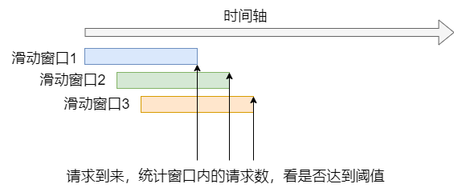
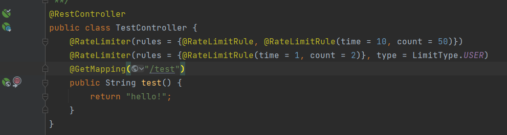
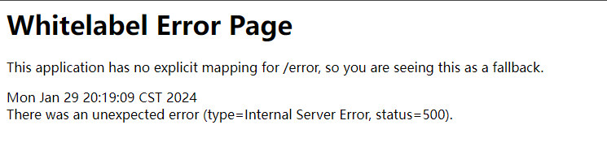

# 常见限流算法

1. 固定窗口算法

   在固定的时间窗口下进行计数，达到阈值就拒绝请求。固定窗口如果在窗口开始就打满阈值，窗口后半部分进入的请求都会拒绝。

2. 滑动窗口算法

   在固定窗口的基础上，窗口会随着时间向前推移，可以在时间内平滑控制流量，解决固定窗口出现的突发流量问题。

3. 漏斗算法

   请求来了先进入漏斗，漏斗以恒定的速率放行请求。

4. 令牌桶算法

   在令牌桶中，以恒定的速率放入令牌，令牌桶也有一定的容量，如果满了令牌就无法放进去了。拿到令牌的请求通过，并消耗令牌，如果令牌桶中令牌为空，则会丢弃该请求。



# redis实现滑动窗口算法

当有请求来的时候记录时间戳，统计窗口内请求的数量时只需要统计redis中记录的数量。可以使用redis中的zset结构来存储。key可以设置为请求的资源名，同时根据限流的对象，往key中加入限流对象信息。比如根据ip限制访问某个资源的流量，可以使用方法名+ip作为key。score设置为时间戳。value则可以根据请求参数等信息生成MD5，或者直接生成UUID来存入，防止并发时多个请求存入的score和value一样导致只存入一个数据。

步骤如下：

1. 定义时间窗口
2. 请求到来，丢弃时间窗口之外的数据，`ZREMRANGEBYSCORE KEYS[i], -inf, window_start`
3. 判断时间窗口内的请求个数是否达到阈值。`ZCARD KEYS[i]` 要小于阈值
4. 如果小于则通过`zadd`加入，超过则返回不放行

lua脚本:

```lua
local window_start = tonumber(ARGV[1])- tonumber(ARGV[2])
redis.call('ZREMRANGEBYSCORE', KEYS[1], '-inf', window_start)
local current_requests = redis.call('ZCARD', KEYS[1])
if current_requests < tonumber(ARGV[3]) then
    redis.call('ZADD', KEYS[1], tonumber(ARGV[1]), ARGV[4])
    return 1
else
    return 0
end
```


# java通过注解+切面实现限流

在java中，我们的需求是对资源可以进行多种规则的限流。注解可以定义不同类型的限流，如：全局限流，根据IP限流，根据用户限流。对每种类型的限流可以在一个注解中定义多个限流规则。

整体效果如下：

```java
@RateLimiter(rules = {@RateLimitRule(time = 50,count = 100),@RateLimitRule(time = 20,count = 10)}, type = LimitType.IP)
@RateLimiter(rules = {@RateLimitRule(time = 60,count = 1000)}, type = LimitType.DEFAULT)
public void update(){

}
```


## 定义注解

定义了三个注解：

1. RateLimiter：限流注解
2. RateLimitRule：限流规则
3. RateLimiters：存放多个限流注解的容器，为了可以在重复使用该注解

RateLimiter：

```java
@Target(ElementType.METHOD)
@Retention(RetentionPolicy.RUNTIME)
@Documented
// 支持重复注解
@Repeatable(value = RateLimiters.class)
public @interface RateLimiter {

    /**
     * 限流键前缀
     *
     * @return
     */
    String key() default "rate_limit:";

    /**
     * 限流规则
     *
     * @return
     */
    RateLimitRule[] rules() default {};

    /**
     * 限流类型
     *
     * @return
     */
    LimitType type() default LimitType.DEFAULT;
}
```

RateLimitRule：

```java
public @interface RateLimitRule {
    /**
     * 时间窗口, 单位秒
     *
     * @return
     */
    int time() default 60;

    /**
     * 允许请求数
     *
     * @return
     */
    int count() default 100;
}
```

RateLimiters：

```java
@Target(ElementType.METHOD)
@Retention(RetentionPolicy.RUNTIME)
@Documented
public @interface RateLimiters {
    RateLimiter[] value();
}
```


## 改造lua脚本

在实现切面之前，我们需要对lua脚本进行改造。我们的需求对资源可以进行多种规则的限流。根据限流类型和限流规则可以组合出不同的key，比如我们要对某个资源进行以下规则限流：全局限流（60s，1000次; 600s，5000次），根据ip限流（2s，5次）。

根据这些规则我们就需要使用3个zset分别来存放请求记录。并且当三个规则都没达到阈值时才放行请求，否则拒绝请求。

对lua脚本改造，支持多个key。

```lua
local flag = 1
for i = 1, #KEYS do
    local window_start = tonumber(ARGV[1])- tonumber(ARGV[(i-1)*3+2])
    redis.call('ZREMRANGEBYSCORE', KEYS[i], '-inf', window_start)
    local current_requests = redis.call('ZCARD', KEYS[i])
    if current_requests < tonumber(ARGV[(i-1)*3+3]) then
        redis.call('ZADD', KEYS[i], tonumber(ARGV[1]), ARGV[(i-1)*3+4])
    else
        flag = 0
    end
end
return flag
```


## 定义切面

定义一个切面实现限流逻辑：RateLimiterAspect

首先定义切点，由于我们可以重复使用注解，所以需要把RateLimiter和RateLimiters都定义为切点

```java
@Pointcut("@annotation(com.imgyh.framework.annotation.RateLimiter)")
public void rateLimiter() {
}

@Pointcut("@annotation(com.imgyh.framework.annotation.RateLimiters)")
public void rateLimiters() {
}
```

在前置通知中实现限流逻辑：

主要流程如下：

1. 把所有的RateLimiter都拿到，解析出限流规则和限流类型
2. 根据限流规则和限流类型，获取所有的key和参数，为调用lua脚本做准备
3. 调用lua脚本，根据返回值判断是否放行请求

```java
// 定义切点之前的操作
@Before("rateLimiter() || rateLimiters()")
public void doBefore(JoinPoint point) {
    try {
        // 从切点获取方法签名
        MethodSignature signature = (MethodSignature) point.getSignature();
        // 获取方法
        Method method = signature.getMethod();
        String name = point.getTarget().getClass().getName() + "." + signature.getName();
        // 获取日志注解
        RateLimiter rateLimiter = method.getAnnotation(RateLimiter.class);
        RateLimiters rateLimiters = method.getAnnotation(RateLimiters.class);

        List<RateLimiter> limiters = new ArrayList<>();
        if (ObjectUtils.isNotNull(rateLimiter)) {
            limiters.add(rateLimiter);
        }

        if (ObjectUtils.isNotNull(rateLimiters)) {
            limiters.addAll(Arrays.asList(rateLimiters.value()));
        }

        if (!allowRequest(limiters, name)) {
            throw new ServiceException("访问过于频繁，请稍候再试");
        }

    } catch (ServiceException e) {
        throw e;
    } catch (Exception e) {
        throw new RuntimeException("服务器限流异常，请稍候再试");
    }
}

/**
     * 是否允许请求
     *
     * @param rateLimiters 限流注解
     * @param name         方法全名
     * @return 是否放行
     */
private boolean allowRequest(List<RateLimiter> rateLimiters, String name) {
    List<String> keys = getKeys(rateLimiters, name);
    Object[] args = getArgs(rateLimiters);
    Object res = redisTemplate.execute(limitScript, keys, args);

    return ObjectUtils.isNotNull(res) && (Long) res == 1L;
}

/**
     * 获取限流的键
     *
     * @param rateLimiters 限流注解
     * @param name         方法全名
     * @return
     */
private List<String> getKeys(List<RateLimiter> rateLimiters, String name) {
    List<String> keys = new ArrayList<>();

    for (RateLimiter rateLimiter : rateLimiters) {
        String key = rateLimiter.key();
        RateLimitRule[] rules = rateLimiter.rules();
        LimitType type = rateLimiter.type();

        StringBuilder sb = new StringBuilder();
        sb.append(key).append(name);

        if (LimitType.IP == type) {
            String ipAddr = IpUtils.getIpAddr();
            sb.append("_").append(ipAddr);
        } else if (LimitType.USER == type) {
            Long userId = SecurityUtils.getUserId();
            sb.append("_").append(userId);
        }
        for (RateLimitRule rule : rules) {
            int time = rule.time() * 1000;
            int count = rule.count();
            StringBuilder builder = new StringBuilder(sb);
            builder.append("_").append(time).append("_").append(count);
            keys.add(builder.toString());
        }
    }
    return keys;
}

/**
     * 获取需要的参数
     *
     * @param rateLimiters 限流注解
     * @return
     */
private Object[] getArgs(List<RateLimiter> rateLimiters) {
    List<Object> args = new ArrayList<>();
    args.add(System.currentTimeMillis());
    for (RateLimiter rateLimiter : rateLimiters) {
        RateLimitRule[] rules = rateLimiter.rules();
        for (RateLimitRule rule : rules) {
            int time = rule.time() * 1000;
            int count = rule.count();
            args.add(time);
            args.add(count);
            args.add(IdUtils.fastSimpleUUID());
        }
    }
    return args.toArray();
}
```


# 实例demo演示

demo源码仓库：https://github.com/imgyh/developer-workspace/tree/main/java/redis/RateLimiter

定义接口，并添加限流注解。

限制对某个用户只能1s中访问2次。对接口整体10s中访问50次，60秒访问100次。



当某个用户一秒钟请求超过两次时，抛出异常。



# 参考资源

1. Hollis，《Java面试宝典》
2. [一文搞懂高频面试题之限流算法，从算法原理到实现，再到对比分析](https://juejin.cn/post/6870396751178629127)